# 実験設定と結果まとめ（`syn_data2`）

## 1. 実験フロー

1. `syn_data2/make_syn_data2.py` で合成画像と正解ラベルを生成
2. 生成データで `train.py` を実行し，パラメータを推定
3. 推定パラメータを用いて `estimate_label.py` でテスト画像のラベル推定

## 2. 実験設定

## 2.1 データ生成（`syn_data2/make_syn_data2.py`）

- 画像サイズ（レジュメ記法）: $D=2^{d_{\mathrm{max}}}$，本実験では $d_{\mathrm{max}}=8$，したがって $D=256$
- ラベル集合: $\mathcal{X}=\{0,1,2\}$（背景，矩形，円）
- データ数: 学習データ数 $N=100$，評価データ数 $5$
- 生成分布（画素値）:
  - ラベル1（矩形）: $y\sim\mathcal{N}(\mu_1,\sigma_1^2)$，$(\mu_1,\sigma_1)=(150,20)$
  - ラベル2（円）: $y\sim\mathcal{N}(\mu_2,\sigma_2^2)$，$(\mu_2,\sigma_2)=(150,20)$
  - ラベル0（背景）: $y\sim\mathcal{N}(\mu_3,\sigma_3^2)$，$(\mu_3,\sigma_3)=(100,70)$
- 形状生成規則:
  - 大円を1個配置（面積は画像の $1/9$ から $1/4$）
  - 小矩形を4から8個配置（既存図形との重なりを回避）

補足: `make_syn_data2.py` の保存先文字列は `./syn_data/...` だが，本レポートは実際の成果物が保存されている `syn_data2` 配下を対象とする。

## 2.2 学習（`train.py`）

- 学習データ: `syn_data2/train_data/images`, `syn_data2/train_data/labels`
- データ枚数確認: train images = 100, train labels = 100, test images = 5, test labels = 5
- 推定出力（レジュメ記法）:
  - 四分木事前分布パラメータの推定値: $\hat{\bm{g}}$
  - ラベル事前分布パラメータの推定値: $\hat{\bm{\omega}}$
  - ピクセル値分布パラメータの推定値: $\hat{\bm{\theta}}$
- 推定ファイル:
  - `syn_data2/estimated_param/branch_probs.json`
  - `syn_data2/estimated_param/label_param.json`
  - `syn_data2/estimated_param/pixel_param.json`

## 2.3 推定（`estimate_label.py`）

- テスト対象: `syn_data2/test_data/images` の5枚（`test_000.png` から `test_004.png`）
- 推定手法（レジュメ記法）:
  - 事後分布 $p(T\mid Y)$ に対して $\hat{T}=\arg\max_T p(T\mid Y)$ を計算
  - 固定した $\hat{T}$ の下で，$p(c_s\mid \bm{c}_{-s},\hat{T},Y)$ に基づくギブス更新
  - 最終領域 $R(\hat{\bm{c}})$ 上で
  - $\hat{x}_r=\arg\max_{x\in\mathcal{X}}\left(\log p(x_r;\hat{\bm{\omega}})+\sum_{(i,j)\in r}\log p(y_{(i,j)}\mid x;\hat{\theta}_x)\right)$
  - を用いて $\hat{X}$ を推定
- 反復回数: $M=20$
- バーンイン設定: $B=50$（実装設定）
- OA記録: 各イテレーションで `*_oa_log.txt` に保存

## 3. 実験結果

## 3.1 主要定量結果（OA）

OAログ: `syn_data2/estimation_results/label/test_000_oa_log.txt` から `syn_data2/estimation_results/label/test_004_oa_log.txt`

| テスト画像 | Iter.1 OA | Iter.20 OA | 平均OA | 最小OA | 最大OA |
|---|---:|---:|---:|---:|---:|
| `test_000` | 0.991089 | 0.977524 | 0.986789 | 0.975983 | 0.993393 |
| `test_001` | 0.991272 | 0.993057 | 0.989032 | 0.969299 | 0.993820 |
| `test_002` | 0.993042 | 0.994553 | 0.993060 | 0.991333 | 0.994553 |
| `test_003` | 0.992264 | 0.980835 | 0.987160 | 0.958511 | 0.994873 |
| `test_004` | 0.979614 | 0.973190 | 0.979413 | 0.959579 | 0.993317 |

## 3.2 推定パラメータ（抜粋）

### 四分木事前分布パラメータ $\hat{\bm{g}}$（深さ別）

`syn_data2/estimated_param/branch_probs.json`:

$$
(\hat{g}_0,\hat{g}_1,\dots,\hat{g}_8)=
(1.0,0.9850,0.7334,0.5333,0.5128,0.4794,0.4344,0.3342,0)
$$

### ラベル事前分布パラメータ $\hat{\bm{\omega}}$

`syn_data2/estimated_param/label_param.json`（`label_num=3`）:

- ラベル0: $(b,w_1,w_2,w_3)=(-95.1724,\ 6.1112,\ 5.7695,\ -1.9461)$
- ラベル1: $(b,w_1,w_2,w_3)=(77.4324,\ -6.5004,\ -3.4069,\ 0.2563)$
- ラベル2: $(b,w_1,w_2,w_3)=(17.7400,\ 0.3892,\ -2.3627,\ 1.6898)$

### ピクセル値分布パラメータ $\hat{\bm{\theta}}$

`syn_data2/estimated_param/pixel_param.json`（1チャネル）:

- ラベル0: $\hat{\mu}_0=101.5950$, $\hat{\sigma}_0=64.4662$
- ラベル1: $\hat{\mu}_1=149.5399$, $\hat{\sigma}_1=19.9764$
- ラベル2: $\hat{\mu}_2=149.5123$, $\hat{\sigma}_2=20.0134$

## 4. 可視化結果

### 4.1 `test_000`

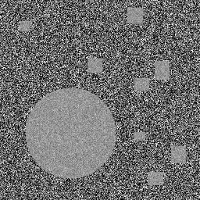
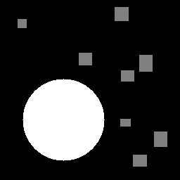
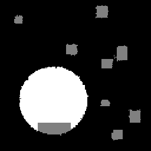
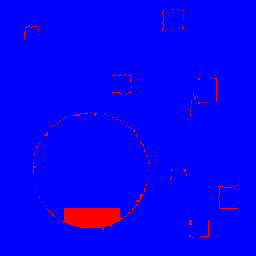

### 4.2 `test_001`

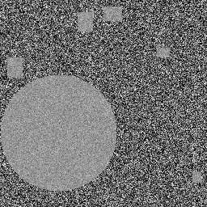
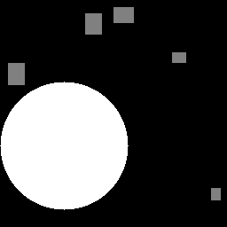

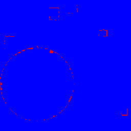

### 4.3 `test_002`

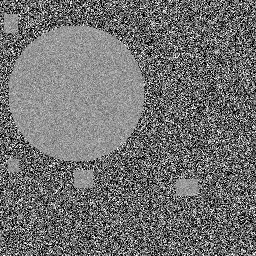
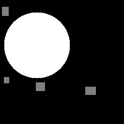

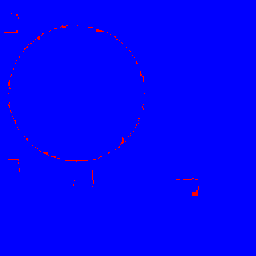

### 4.4 `test_003`

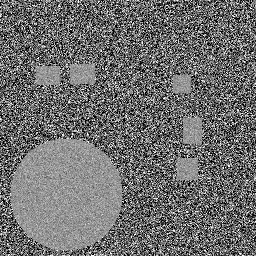
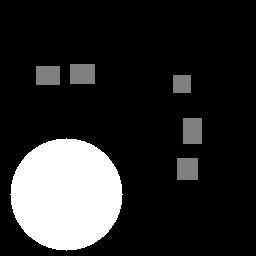
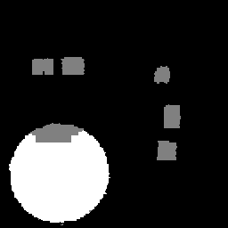
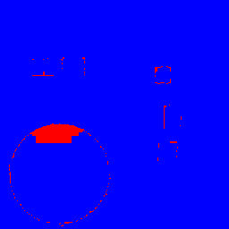

### 4.5 `test_004`

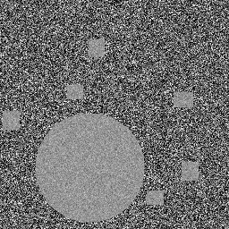
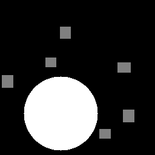
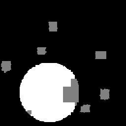
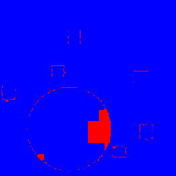

## 5. 補足

- `config.py` の既定値とは独立に，本レポートは `syn_data2` 配下の実成果物（ログ，推定パラメータ，画像）を基準として整理した。
- `estimate_label.py` では $B=50$ かつ $M=20$ のため，全反復ログを保存しつつ最終反復結果を出力する動作になっている。