# ISITA2026に向けた実験報告

この資料はISITA2026投稿に向けた実験結果または今後実験をする予定の事項を報告するものである．

実験が完了している事項には適宜実験結果を記載しており，結果が未記載の箇所はこれから実験予定とする事項である．

## 1. 仮定した確率的生成モデルの挙動や表現力を確認することを目的とした実験

### 1.1 四分木の事前分布
- 事前分布の確率関数
    $$
    p(T;\mathbf{g})=\prod_{s\in \mathcal{L}(T)}(1-g_s)\prod_{s'\in \mathcal{I}(T)}g_{s'}
    $$

- 深さごとに以下のようなパラメータ$g_s$を設定し，生成される四分木と出現する葉ノードの深さの分布を調査する．

    - 全ノード共通のパラメータを設定

        ### [exp. 1.1.1]

        | 深さ | 0 | 1 | 2 | 3 | 4 | 5 | 6 | 7 |
        |---|---:|---:|---:|---:|---:|---:|---:|---:|
        | パラメータ $g_s$ | 0.9 | 0.9 | 0.9 | 0.9 | 0.9 | 0.9 | 0.9 | 0 |

        - 生成された四分木

                

        - 出現する葉ノードの深さの分布

            

        ### [exp. 1.1.2]

        | 深さ | 0 | 1 | 2 | 3 | 4 | 5 | 6 | 7 |
        |---|---:|---:|---:|---:|---:|---:|---:|---:|
        | パラメータ $g_s$ | 0.5 | 0.5 | 0.5 | 0.5 | 0.5 | 0.5 | 0.5 | 0 |

        - 生成された四分木

                

        - 出現する葉ノードの深さの分布

            

    - ノードの深さが深くなるほどパラメータの値が小さくなるように設定

        ### [exp. 1.1.3]

        | 深さ | 0 | 1 | 2 | 3 | 4 | 5 | 6 | 7 |
        |---|---:|---:|---:|---:|---:|---:|---:|---:|
        | パラメータ $g_s$ | 0.9 | 0.8 | 0.7 | 0.6 | 0.5 | 0.4 | 0.3 | 0 |

        - 生成された四分木

                

        - 出現する葉ノードの深さの分布

            

        (exp. 1.1.4)

        | 深さ | 0 | 1 | 2 | 3 | 4 | 5 | 6 | 7 |
        |---|---:|---:|---:|---:|---:|---:|---:|---:|
        | パラメータ $g_s$ | 0.9 | 0.9 | 0.9 | 0.5 | 0.5 | 0.5 | 0.5 | 0 |

        - 生成された四分木

                

        - 出現する葉ノードの深さの分布

            

- 考察

### 1.2 領域の事前分布

- 統合領域の事前分布: ddCRPモデル

    $$
    p(c_s=s'\mid T;\alpha,\beta,\eta)\propto
    \begin{cases}
    \dfrac{f(s,s')}{\alpha+\sum_{s''\in \mathcal{L}(T)\setminus\{s\}}f(s,s'')} & (s\neq s')\\
    \dfrac{\alpha}{\alpha+\sum_{s''\in \mathcal{L}(T)\setminus\{s\}}f(s,s'')} & (s=s')
    \end{cases}
    $$

    ここで，親和度関数$f(s, s')$は以下のように設定している:

    $$
    f(s,s')=
    \begin{cases}
    \exp\left(\beta B(s,s')+\eta(\mathrm{depth}(s)-\mathrm{depth}(s'))\right) & (\text{$s$と$s'$が隣接している})\\
    0 & (\text{$s$と$s'$が隣接していない})
    \end{cases}
    $$

- パラメータ$\alpha,\beta,\eta$を変化させることで，生成される統合領域の特徴の変化を調査する．

    パラメータはそれぞれ3パターンずつ変化させる．

    - $\alpha = 1.0\times 10^{-8}, 1.0\times 10^{-4}, 1.0$

    - $\beta = 0, 8.0, 30.0$

    - $\eta = 0, 8.0, 30.0$

    また，生成された統合領域の幾何学的特徴量の分布を調べる．今回調査する幾何学的特徴量は以下の通り．

    - 面積

    - 周の長さ

    - 円形度

    ### [exp. 1.2.1]

    exp. 1.1.1で生成された以下の四分木を対象に統合領域を生成する．

    

    - 生成された統合領域（各セルは代表例として region_000.png を掲載）

        <table>
          <tr>
            <th>&alpha; = 1.0</th>
            <th>&alpha; = 1.0 &times; 10-4</th>
            <th>&alpha; = 1.0 &times; 10-8</th>
          </tr>
          <tr>
            <td>
              <table>
                <tr><th></th><th>&eta; = 0</th><th>&eta; = 8.0</th><th>&eta; = 30.0</th></tr>
                <tr>
                  <th>&beta; = 0</th>
                  <td></td>
                  <td></td>
                  <td></td>
                </tr>
                <tr>
                  <th>&beta; = 8.0</th>
                  <td></td>
                  <td></td>
                  <td></td>
                </tr>
                <tr>
                  <th>&beta; = 30.0</th>
                  <td></td>
                  <td></td>
                  <td></td>
                </tr>
              </table>
            </td>
            <td>
              <table>
                <tr><th></th><th>&eta; = 0</th><th>&eta; = 8.0</th><th>&eta; = 30.0</th></tr>
                <tr>
                  <th>&beta; = 0</th>
                  <td></td>
                  <td></td>
                  <td></td>
                </tr>
                <tr>
                  <th>&beta; = 8.0</th>
                  <td></td>
                  <td></td>
                  <td></td>
                </tr>
                <tr>
                  <th>&beta; = 30.0</th>
                  <td></td>
                  <td></td>
                  <td></td>
                </tr>
              </table>
            </td>
            <td>
              <table>
                <tr><th></th><th>&eta; = 0</th><th>&eta; = 8.0</th><th>&eta; = 30.0</th></tr>
                <tr>
                  <th>&beta; = 0</th>
                  <td></td>
                  <td></td>
                  <td></td>
                </tr>
                <tr>
                  <th>&beta; = 8.0</th>
                  <td></td>
                  <td></td>
                  <td></td>
                </tr>
                <tr>
                  <th>&beta; = 30.0</th>
                  <td></td>
                  <td></td>
                  <td></td>
                </tr>
              </table>
            </td>
          </tr>
        </table>

    - 生成された統合領域の幾何学的特徴量の分布

        - 面積

          
<strong>&alpha; = 1.0 &times; 10-8</strong>

          

          
<strong>&alpha; = 1.0 &times; 10-4</strong>

          

          
<strong>&alpha; = 1.0</strong>

          

        - 周の長さ

          
<strong>&alpha; = 1.0 &times; 10-8</strong>

          

          
<strong>&alpha; = 1.0 &times; 10-4</strong>

          

          
<strong>&alpha; = 1.0</strong>

          

        - 円形度

          
<strong>&alpha; = 1.0 &times; 10-8</strong>

          

          
<strong>&alpha; = 1.0 &times; 10-4</strong>

          

          
<strong>&alpha; = 1.0</strong>

          

    ### [exp. 1.2.2]

    exp. 1.1.2で生成された以下の四分木を対象に統合領域を生成する．

    

    - 生成された統合領域（各セルは代表例として region_000.png を掲載）

        <table>
          <tr>
            <th>&alpha; = 1.0</th>
            <th>&alpha; = 1.0 &times; 10-4</th>
            <th>&alpha; = 1.0 &times; 10-8</th>
          </tr>
          <tr>
            <td>
              <table>
                <tr><th></th><th>&eta; = 0</th><th>&eta; = 8.0</th><th>&eta; = 30.0</th></tr>
                <tr>
                  <th>&beta; = 0</th>
                  <td></td>
                  <td></td>
                  <td></td>
                </tr>
                <tr>
                  <th>&beta; = 8.0</th>
                  <td></td>
                  <td></td>
                  <td></td>
                </tr>
                <tr>
                  <th>&beta; = 30.0</th>
                  <td></td>
                  <td></td>
                  <td></td>
                </tr>
              </table>
            </td>
            <td>
              <table>
                <tr><th></th><th>&eta; = 0</th><th>&eta; = 8.0</th><th>&eta; = 30.0</th></tr>
                <tr>
                  <th>&beta; = 0</th>
                  <td></td>
                  <td></td>
                  <td></td>
                </tr>
                <tr>
                  <th>&beta; = 8.0</th>
                  <td></td>
                  <td></td>
                  <td></td>
                </tr>
                <tr>
                  <th>&beta; = 30.0</th>
                  <td></td>
                  <td></td>
                  <td></td>
                </tr>
              </table>
            </td>
            <td>
              <table>
                <tr><th></th><th>&eta; = 0</th><th>&eta; = 8.0</th><th>&eta; = 30.0</th></tr>
                <tr>
                  <th>&beta; = 0</th>
                  <td></td>
                  <td></td>
                  <td></td>
                </tr>
                <tr>
                  <th>&beta; = 8.0</th>
                  <td></td>
                  <td></td>
                  <td></td>
                </tr>
                <tr>
                  <th>&beta; = 30.0</th>
                  <td></td>
                  <td></td>
                  <td></td>
                </tr>
              </table>
            </td>
          </tr>
        </table>

    - 生成された統合領域の幾何学的特徴量の分布

        - 面積

          
<strong>&alpha; = 1.0 &times; 10-8</strong>

          

          
<strong>&alpha; = 1.0 &times; 10-4</strong>

          

          
<strong>&alpha; = 1.0</strong>

          

        - 周の長さ

          
<strong>&alpha; = 1.0 &times; 10-8</strong>

          

          
<strong>&alpha; = 1.0 &times; 10-4</strong>

          

          
<strong>&alpha; = 1.0</strong>

          

        - 円形度

          
<strong>&alpha; = 1.0 &times; 10-8</strong>

          

          
<strong>&alpha; = 1.0 &times; 10-4</strong>

          

          
<strong>&alpha; = 1.0</strong>

          

    ### [exp. 1.2.3]

    exp. 1.1.3で生成された以下の四分木を対象に統合領域を生成する．

    

    - 生成された統合領域（各セルは代表例として region_000.png を掲載）

        <table>
          <tr>
            <th>&alpha; = 1.0</th>
            <th>&alpha; = 1.0 &times; 10-4</th>
            <th>&alpha; = 1.0 &times; 10-8</th>
          </tr>
          <tr>
            <td>
              <table>
                <tr><th></th><th>&eta; = 0</th><th>&eta; = 8.0</th><th>&eta; = 30.0</th></tr>
                <tr>
                  <th>&beta; = 0</th>
                  <td></td>
                  <td></td>
                  <td></td>
                </tr>
                <tr>
                  <th>&beta; = 8.0</th>
                  <td></td>
                  <td></td>
                  <td></td>
                </tr>
                <tr>
                  <th>&beta; = 30.0</th>
                  <td></td>
                  <td></td>
                  <td></td>
                </tr>
              </table>
            </td>
            <td>
              <table>
                <tr><th></th><th>&eta; = 0</th><th>&eta; = 8.0</th><th>&eta; = 30.0</th></tr>
                <tr>
                  <th>&beta; = 0</th>
                  <td></td>
                  <td></td>
                  <td></td>
                </tr>
                <tr>
                  <th>&beta; = 8.0</th>
                  <td></td>
                  <td></td>
                  <td></td>
                </tr>
                <tr>
                  <th>&beta; = 30.0</th>
                  <td></td>
                  <td></td>
                  <td></td>
                </tr>
              </table>
            </td>
            <td>
              <table>
                <tr><th></th><th>&eta; = 0</th><th>&eta; = 8.0</th><th>&eta; = 30.0</th></tr>
                <tr>
                  <th>&beta; = 0</th>
                  <td></td>
                  <td></td>
                  <td></td>
                </tr>
                <tr>
                  <th>&beta; = 8.0</th>
                  <td></td>
                  <td></td>
                  <td></td>
                </tr>
                <tr>
                  <th>&beta; = 30.0</th>
                  <td></td>
                  <td></td>
                  <td></td>
                </tr>
              </table>
            </td>
          </tr>
        </table>

    - 生成された統合領域の幾何学的特徴量の分布

        - 面積

          
<strong>&alpha; = 1.0 &times; 10-8</strong>

          

          
<strong>&alpha; = 1.0 &times; 10-4</strong>

          

          
<strong>&alpha; = 1.0</strong>

          

        - 周の長さ

          
<strong>&alpha; = 1.0 &times; 10-8</strong>

          

          
<strong>&alpha; = 1.0 &times; 10-4</strong>

          

          
<strong>&alpha; = 1.0</strong>

          

        - 円形度

          
<strong>&alpha; = 1.0 &times; 10-8</strong>

          

          
<strong>&alpha; = 1.0 &times; 10-4</strong>

          

          
<strong>&alpha; = 1.0</strong>

          

    ### [exp. 1.2.4]

    exp. 1.1.4で生成された以下の四分木を対象に統合領域を生成する．

    

    - 生成された統合領域（各セルは代表例として region_000.png を掲載）

        <table>
          <tr>
            <th>&alpha; = 1.0</th>
            <th>&alpha; = 1.0 &times; 10-4</th>
            <th>&alpha; = 1.0 &times; 10-8</th>
          </tr>
          <tr>
            <td>
              <table>
                <tr><th></th><th>&eta; = 0</th><th>&eta; = 8.0</th><th>&eta; = 30.0</th></tr>
                <tr>
                  <th>&beta; = 0</th>
                  <td></td>
                  <td></td>
                  <td></td>
                </tr>
                <tr>
                  <th>&beta; = 8.0</th>
                  <td></td>
                  <td></td>
                  <td></td>
                </tr>
                <tr>
                  <th>&beta; = 30.0</th>
                  <td></td>
                  <td></td>
                  <td></td>
                </tr>
              </table>
            </td>
            <td>
              <table>
                <tr><th></th><th>&eta; = 0</th><th>&eta; = 8.0</th><th>&eta; = 30.0</th></tr>
                <tr>
                  <th>&beta; = 0</th>
                  <td></td>
                  <td></td>
                  <td></td>
                </tr>
                <tr>
                  <th>&beta; = 8.0</th>
                  <td></td>
                  <td></td>
                  <td></td>
                </tr>
                <tr>
                  <th>&beta; = 30.0</th>
                  <td></td>
                  <td></td>
                  <td></td>
                </tr>
              </table>
            </td>
            <td>
              <table>
                <tr><th></th><th>&eta; = 0</th><th>&eta; = 8.0</th><th>&eta; = 30.0</th></tr>
                <tr>
                  <th>&beta; = 0</th>
                  <td></td>
                  <td></td>
                  <td></td>
                </tr>
                <tr>
                  <th>&beta; = 8.0</th>
                  <td></td>
                  <td></td>
                  <td></td>
                </tr>
                <tr>
                  <th>&beta; = 30.0</th>
                  <td></td>
                  <td></td>
                  <td></td>
                </tr>
              </table>
            </td>
          </tr>
        </table>

    - 生成された統合領域の幾何学的特徴量の分布

        - 面積

          
<strong>&alpha; = 1.0 &times; 10-8</strong>

          

          
<strong>&alpha; = 1.0 &times; 10-4</strong>

          

          
<strong>&alpha; = 1.0</strong>

          

        - 周の長さ

          
<strong>&alpha; = 1.0 &times; 10-8</strong>

          

          
<strong>&alpha; = 1.0 &times; 10-4</strong>

          

          
<strong>&alpha; = 1.0</strong>

          

        - 円形度

          
<strong>&alpha; = 1.0 &times; 10-8</strong>

          

          
<strong>&alpha; = 1.0 &times; 10-4</strong>

          

          
<strong>&alpha; = 1.0</strong>

          

- 考察
    

### 1.3 ラベルの事前分布

今回は，面積，周の長さ，円形度の3つの幾何学的特徴量から，統合領域$r\in R(\bm{c})$それぞれに対して独立にラベルが付与されるモデルを想定している．

$$p(X\mid R(\bm{c}))=\prod_{r\in R(\bm{c})}p(x_r).$$

$$\bm{\phi}(r) = (\phi_1(r), \phi_2(r), \phi_3(r)) = (\log(\text{Area}(r)), \log(\text{Perimeter}(r)), \text{Circularity}(r))$$

#### 1.3.1 幾何学的特徴量をもとに正規分布の確率の重みからラベルが発生するモデル

- $p(x_r)$を以下のように仮定する．

    $$z(\phi_i(r)\mid x_r=x) =\mathcal{N} \left(\phi_i(r);m_i^{(x)},\left(\sigma_i^{(x)}\right)^2\right)$$
    $$z\left(\boldsymbol{\phi}(r)\mid x_r=x\right) =
    \prod_{i=1}^{|\bm{\phi}|}
    z(\phi_i(r)\mid x_r=x)$$
    $$p(x_r=x) = 
    \frac{
    z\left(\boldsymbol{\phi}(r)\mid x_r=x\right)
    }{
    \sum\limits_{x'\in\mathcal{X}}
    z\left(\boldsymbol{\phi}(r)\mid x_r=x'\right)
    }$$

- 統合領域をもとにラベルを発生させ，各ラベルごとの特徴に沿うようにラベルが発生しているかを調査する．

    ### [exp 1.3.1.1]

    exp.1.2.3において，$\alpha = 1.0\times10^{-4}, \beta=8.0, \eta=8.0$で生成された以下の統合領域に対して，以下のパラメータを設定してラベルを発生させる．

    　

    | | $x=0$ | $x=1$ | $x=2$ |
    |---|---:|---:|---:|
    | log Area: $(m_1^{(x)}, \sigma_1^{(x)})$ | $(4.0, 1.0)$ | $(6.5,1.5)$ | $(9.0, 1.0)$  |
    | log Perimeter: $(m_2^{(x)}, \sigma_2^{(x)})$ | $(3.5, 0.5)$ | $(5, 0.5)$ | $(6, 0.5)$ |
    | Circularity: $(m_3^{(x)}, \sigma_3^{(x)})$ | $(0.45, 0.2)$ | $(0.5, 0.1)$ | $(0.7, 0.1)$ |

    発生させたラベル画像は以下の通り．

    - 領域番号ごとの特徴量と対応する事前確率

      | | region 1 | region 2 | region 3 | region 4 | region 5 | region 6 | region 7 | region 8 |
      |---|---|---|---|---|---|---|---|---|
      | $\phi_1$: log_area | 1.39 | 8.88 | 3.50 | 4.44 | 7.36 | 8.83 | 6.35 | 4.29 |
      | $z(\phi_1\|x_r=0)$ | 0.01 | 0.00 | 0.35 | 0.36 | 0.00 | 0.00 | 0.03 | 0.38 |
      | $z(\phi_1\|x_r=1)$ | 0.00 | 0.08 | 0.04 | 0.10 | 0.23 | 0.08 | 0.26 | 0.09 |
      | $z(\phi_1\|x_r=2)$ | 0.00 | 0.40 | 0.00 | 0.00 | 0.10 | 0.39 | 0.01 | 0.00 |
      | $\phi_2$: log_perimeter | 2.20 | 6.18 | 3.22 | 3.71 | 5.32 | 6.08 | 4.84 | 3.76 |
      | $z(\phi_2\|x_r=0)$ | 0.03 | 0.00 | 0.68 | 0.73 | 0.00 | 0.00 | 0.02 | 0.70 |
      | $z(\phi_2\|x_r=1)$ | 0.00 | 0.05 | 0.00 | 0.03 | 0.65 | 0.08 | 0.76 | 0.04 |
      | $z(\phi_2\|x_r=2)$ | 0.00 | 0.75 | 0.00 | 0.00 | 0.32 | 0.79 | 0.06 | 0.00 |
      | $\phi_3$: circularity | 0.59 | 0.39 | 0.70 | 0.66 | 0.47 | 0.45 | 0.45 | 0.51 |
      | $z(\phi_3\|x_r=0)$ | 1.57 | 1.92 | 0.92 | 1.15 | 1.98 | 1.99 | 1.99 | 1.90 |
      | $z(\phi_3\|x_r=1)$ | 2.68 | 2.26 | 0.56 | 1.11 | 3.85 | 3.57 | 3.53 | 3.96 |
      | $z(\phi_3\|x_r=2)$ | 2.16 | 0.04 | 3.99 | 3.68 | 0.30 | 0.19 | 0.18 | 0.69 |
      | $p(x_r=0)$ | 1.00 | 0.00 | 1.00 | 0.99 | 0.00 | 0.00 | 0.00 | 0.97 |
      | $p(x_r=1)$ | 0.00 | 0.44 | 0.00 | 0.01 | 0.98 | 0.27 | 1.00 | 0.03 |
      | $p(x_r=2)$ | 0.00 | 0.56 | 0.00 | 0.00 | 0.02 | 0.73 | 0.00 | 0.00 |

    - 生成したラベル画像

      - $x=0$: 黒（0）
      - $x=1$: 灰色（128）
      - $x=2$: 白（255）

      
      
      
      
      

#### 1.3.2 幾何学的特徴量をもとにロジスティック回帰モデルでラベルを発生させるモデル

- $p(x_r)$を以下のように仮定する．

    $$
    p(x_r = x;\bm{\omega}) =\frac{\exp \left( {\bm{\omega}^{(x)}}^{\top} \bm{\phi}(r) \right)}{\sum_{x'\in X} \exp \left( {\bm{\omega}^{(x')}}^{\top} \bm{\phi}(r) \right)}
    $$

- 統合領域をもとにラベルを発生させ，各ラベルごとの特徴に沿うようにラベルが発生しているかを調査する．

    ### [exp 1.3.2.1]

    exp.1.2.3において，$\alpha = 1.0\times10^{-4}, \beta=8.0, \eta=8.0$で生成された以下の統合領域に対して，以下のパラメータを設定してラベルを発生させる．

    　

    | | $x=0$ | $x=1$ | $x=2$ |
    |---|---:|---:|---:|
    | bias: $\omega_0^{(x)}$ | $6.5$ | $-4.5$ | $-31.0$ |
    | log Area: $\omega_1^{(x)}$ | $-1.4$ | $0.1$ | $2.4$ |
    | log Perimeter: $\omega_2^{(x)}$ | $-0.9$ | $1.0$ | $1.8$ |
    | Circularity: $\omega_3^{(x)}$ | $2.8$ | $-2.5$ | $1.5$ |

    発生させたラベル画像は以下の通り．

    - 領域番号ごとの特徴量と対応する事前確率

      | | region 1 | region 2 | region 3 | region 4 | region 5 | region 6 | region 7 | region 8 |
      |---|---|---|---|---|---|---|---|---|
      | $\phi_1$: log_area | 1.39 | 8.88 | 3.50 | 4.44 | 7.36 | 8.83 | 6.35 | 4.29 |
      | $\phi_2$: log_perimeter | 2.20 | 6.18 | 3.22 | 3.71 | 5.32 | 6.08 | 4.84 | 3.76 |
      | $\phi_3$: circularity | 0.59 | 0.39 | 0.70 | 0.66 | 0.47 | 0.45 | 0.45 | 0.51 |
      | ${\bm{\omega}^{(0)}}^{\top} \bm{\phi}(r)$ | 4.23 | -10.39 | 0.66 | -1.21 | -7.27 | -10.07 | -5.48 | -1.46 |
      | ${\bm{\omega}^{(1)}}^{\top} \bm{\phi}(r)$ | -3.64 | 1.58 | -2.68 | -1.99 | 0.38 | 1.33 | -0.15 | -1.59 |
      | ${\bm{\omega}^{(2)}}^{\top}\bm{\phi}(r)$ | -22.83 | 2.03 | -15.77 | -12.66 | -3.05 | 1.82 | -6.38 | -13.16 |
      | $p(x_r=0)$ | 1.00 | 0.00 | 0.97 | 0.68 | 0.00 | 0.00 | 0.00 | 0.53 |
      | $p(x_r=1)$ | 0.00 | 0.39 | 0.03 | 0.32 | 0.97 | 0.38 | 0.99 | 0.47 |
      | $p(x_r=2)$ | 0.00 | 0.61 | 0.00 | 0.00 | 0.03 | 0.62 | 0.00 | 0.00 |

    - 生成したラベル画像

      - $x=0$: 黒（0）
      - $x=1$: 灰色（128）
      - $x=2$: 白（255）

      
      
      
      
      

- 考察

### 1.4 ピクセル値の尤度関数

ピクセル値の尤度関数は以下の通り，各領域内でラベルごとにパラメータが異なる確率関数から生成されるモデルとして仮定している．

$$
p(Y_r\mid x_{r};\bm{\theta}) = p(Y_r;\bm{\theta}_{x_{r}}).
$$

#### 1.4.1 色とノイズの発生のモデル化

- $p(Y_r;\bm{\theta}_{x_{r}})$ を以下のように設定する．

    $$
       p(Y_r\mid x_r;\boldsymbol{\mu}_{x_r},  \Sigma_{x_r})= \prod_{(i,j)\in r} p\bigl(y_{(i,j)};\boldsymbol{\mu}_{x_r},  \Sigma_{x_r}\bigr) 
    $$
    $$
   y_{(i,j)} \sim N^3(\boldsymbol{\mu}_{x_r},  \Sigma_{x_r})
    $$

- 統合領域およびラベル画像をもとに，ピクセル値を生成させる．

    ### [exp 1.4.1.1]
    | | $\bm{\mu}_x$ | $\Sigma_x$ | 
    |---|---|---|
    | $x=0$ | $\begin{bmatrix}200\\50\\50\end{bmatrix}$ | $\begin{bmatrix}20&0&0\\0&20&0\\0&0&20\end{bmatrix}$ |
    | $x=1$ | $\begin{bmatrix}50\\200\\50\end{bmatrix}$ | $\begin{bmatrix}20&0&0\\0&20&0\\0&0&20\end{bmatrix}$ |
    | $x=2$ | $\begin{bmatrix}50\\50\\200\end{bmatrix}$ | $\begin{bmatrix}20&0&0\\0&20&0\\0&0&20\end{bmatrix}$ |

    発生させた画像は以下の通り．

    
    
    
    
    

    ### [exp 1.4.1.2]
    |  | $\bm{\mu}_x$ | $\Sigma_x$ |
    |---|---|---|
    |$x=0$| $\begin{bmatrix}90\\100\\90\end{bmatrix}$ |  $\begin{bmatrix}30&0&0\\0&30&0\\0&0&30\end{bmatrix}$ |
    |$x=1$| $\begin{bmatrix}70\\90\\80\end{bmatrix}$ | $\begin{bmatrix}70&0&0\\0&70&0\\0&0&70\end{bmatrix}$ |
    |$x=2$| $\begin{bmatrix}120\\120\\100\end{bmatrix}$ | $\begin{bmatrix}15&0&0\\0&15&0\\0&0&15\end{bmatrix}$ |

    発生させた画像は以下の通り．

    
    
    
    
    

#### 1.4.2 色とテクスチャとノイズの発生をモデル化

- $p(Y_r;\bm{\theta}_{x_{r}})$ を以下のように設定する．

    $$
       p(Y_r\mid x_r;\boldsymbol{\mu}_{x_r},  \Sigma_{x_r})= \prod_{(i,j)\in r} p\bigl(y_{(i,j)};\boldsymbol{\mu}_{x_r},  \bm{A}^{(x_r)}, \Sigma_{x_r}\bigr) 
    $$
    $$
   y_{(i,j)} \sim N^3(\boldsymbol{\mu}_{x_r} + \sum_{(\Delta i, \Delta j) \in \{(\Delta i', \Delta j')\in \Omega| (i+\Delta i',j+\Delta j')\in r \}}  A_{(\Delta i,\Delta j)}^{(x_r)} (y_{(i+\Delta i,j+\Delta j)} - \boldsymbol{\mu}_{x_r}),  \Sigma_{x_r})
    $$

-   統合領域およびラベル画像をもとに，ピクセル値を生成させる．

    ### [exp 1.4.2.1] 
    
    近傍領域
    
    $\Omega = \{(\Delta i, \Delta j) \mid \Delta i \in \{-2,-1,0\},\, \Delta j \in \{-2,-1,0\}\} \setminus \{(0,0)\}$ (8オフセット)

    | | $\bm{\mu}_x$ | $\bm{A}^{(x)}_\Delta$| $\Sigma_x$ |
    |---|---|---|---|
    |$x=0$| $\begin{bmatrix}200\\50\\50\end{bmatrix}$ | (省略) | $\begin{bmatrix}20&0&0\\0&20&0\\0&0&20\end{bmatrix}$ |
    |$x=1$| $\begin{bmatrix}50\\200\\50\end{bmatrix}$ | (省略) | $\begin{bmatrix}20&0&0\\0&20&0\\0&0&20\end{bmatrix}$ |
    |$x=2$| $\begin{bmatrix}50\\50\\200\end{bmatrix}$ | (省略) | $\begin{bmatrix}20&0&0\\0&20&0\\0&0&20\end{bmatrix}$ |
    
    発生させた画像は以下の通り．

    
    
    
    
    

    ### [exp 1.4.2.2]

    | | $\bm{\mu}_x$ | $\bm{A}^{(x)}_\Delta$（学習ARパラメータ，exp 1.4.2.1と同一）| $\Sigma_x$ |
    |---|---|---|---|
    |$x=0$| $\begin{bmatrix}90.0\\100.0\\90.0\end{bmatrix}$ | (省略) | $\begin{bmatrix}30.0&0&0\\0&30.0&0\\0&0&30.0\end{bmatrix}$ |
    |$x=1$| $\begin{bmatrix}70.0\\90.0\\80.0\end{bmatrix}$ | (省略) | $\begin{bmatrix}70.0&0&0\\0&70.0&0\\0&0&70.0\end{bmatrix}$ |
    |$x=2$| $\begin{bmatrix}120.0\\120.0\\100.0\end{bmatrix}$ | (省略) | $\begin{bmatrix}15.0&0&0\\0&15.0&0\\0&0&15.0\end{bmatrix}$ |
    
    発生させた画像は以下の通り．

    
    
    
    
    

- 考察

## 2. 各種パラメータの推定結果の正確性と性質を精査することを目的とした実験

### 2.1 発生させた人工データから四分木の事前分布のパラメータを推定

統合領域$R(\bm{c})$，ラベル$X$, ピクセル値$Y$を発生させるときのパラメータは以下のように設定．

- 統合領域の事前分布とパラメータ
    - 事前分布の確率関数

        $$
        p(c_s=s'\mid T;\alpha,\beta,\eta)\propto
        \begin{cases}
        \dfrac{f(s,s')}{\alpha+\sum_{s''\in \mathcal{L}(T)\setminus\{s\}}f(s,s'')} & (s\neq s')\\
        \dfrac{\alpha}{\alpha+\sum_{s''\in \mathcal{L}(T)\setminus\{s\}}f(s,s'')} & (s=s')
        \end{cases}
        $$

        $$
        f(s,s')=
        \begin{cases}
        \exp\left(\beta B(s,s')+\eta(\mathrm{depth}(s)-\mathrm{depth}(s'))\right) & (\text{$s$と$s'$が隣接している})\\
        0 & (\text{$s$と$s'$が隣接していない})
        \end{cases}
        $$
    - 設定したパラメータ
        - $\alpha = 1.0\times 10^{-8}$
        - $\beta=8.0$
        - $\eta=8.0$

- ラベルの事前分布とパラメータ

    - 幾何学的特徴量の正規確率に基づくラベルの発生モデル

        $$p(\phi_i(r)\mid x_r=x) =\mathcal{N} \left(\phi_i(r);m_i^{(x)},\left(\sigma_i^{(x)}\right)^2\right)$$
        $$p\left(\boldsymbol{\phi}(r)\mid x_r=x\right) =
        \prod_{i=1}^{|\bm{\phi}|}
        p(\phi_i(r)\mid x_r=x)$$
        $$p(x_r=x) = 
        \frac{
        p\left(\boldsymbol{\phi}(r)\mid x_r=x\right)
        }{
        \sum\limits_{x'\in\mathcal{X}}
        p\left(\boldsymbol{\phi}(r)\mid x_r=x'\right)
        }$$

    - 設定したパラメータ

      | | $x=0$ | $x=1$ | $x=2$ |
      |---|---:|---:|---:|
      | log Area: $(m_1^{(x)}, \sigma_1^{(x)})$ | $(4.0, 1.0)$ | $(6.5,1.5)$ | $(9.0, 1.0)$  |
      | log Perimeter: $(m_2^{(x)}, \sigma_2^{(x)})$ | $(3.5, 0.5)$ | $(5, 0.5)$ | $(6, 0.5)$ |
      | Circularity: $(m_3^{(x)}, \sigma_3^{(x)})$ | $(0.45, 0.2)$ | $(0.5, 0.1)$ | $(0.7, 0.1)$ |

- ピクセル値の尤度関数のパラメータ

    - ピクセル値の尤度関数
        $$
           p(Y_r\mid x_r;\boldsymbol{\mu}_{x_r},  \Sigma_{x_r})= \prod_{(i,j)\in r} p\bigl(y_{(i,j)};\boldsymbol{\mu}_{x_r},  \Sigma_{x_r}\bigr) 
        $$
        $$
            y_{(i,j)} \sim N^3(\boldsymbol{\mu}_{x_r},  \Sigma_{x_r})
        $$

    - 設定したパラメータ
      | | $\bm{\mu}_x$ | $\Sigma_x$ | 
      |---|---|---|
      | $x=0$ | $\begin{bmatrix}200\\50\\50\end{bmatrix}$ | $\begin{bmatrix}20&0&0\\0&20&0\\0&0&20\end{bmatrix}$ |
      | $x=1$ | $\begin{bmatrix}50\\200\\50\end{bmatrix}$ | $\begin{bmatrix}20&0&0\\0&20&0\\0&0&20\end{bmatrix}$ |
      | $x=2$ | $\begin{bmatrix}50\\50\\200\end{bmatrix}$ | $\begin{bmatrix}20&0&0\\0&20&0\\0&0&20\end{bmatrix}$ |

- 四分木は以下の事前分布をもとに発生させる．
    $$
    p(T;\mathbf{g})=\prod_{s\in \mathcal{L}(T)}(1-g_s)\prod_{s'\in \mathcal{I}(T)}g_{s'}
    $$

    パラメータ$g_s$の設定を以下の4パターンで設定し，画像を生成する．そして，生成した画像をもとにパラメータ$g_s$を推定する．

    - ### [exp.2.1.1]
        
        | 深さ | 0 | 1 | 2 | 3 | 4 | 5 | 6 | 7 |
        |---|---:|---:|---:|---:|---:|---:|---:|---:|
        | パラメータ $g_s$ | 0.9 | 0.9 | 0.9 | 0.9 | 0.9 | 0.9 | 0.9 | 0 |

        - 生成された四分木と画像

            |  | sample(1) | sample(2) | sample(3) |
            |---|---|---|---|
            | 生成した画像 | 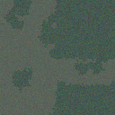 | 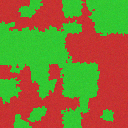 | 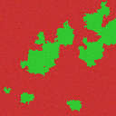 |
            | 真のラベル | 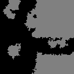 |  | 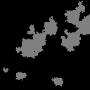 |
            | 真の統合領域 | 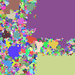 | 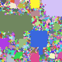 | 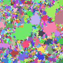 |
            | 真の四分木 | 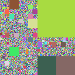 | 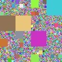 | 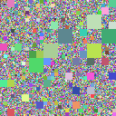 |
            | 推定時にラベルから構築した四分木 | 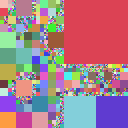 | 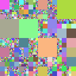 | 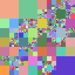 |

        - 推定されたパラメータ$g_s$
          - 学習データ数: 50組
          - パラメータの推定結果

            | 深さ | 0 | 1 | 2 | 3 | 4 | 5 | 6 | 7 |
            |---|---:|---:|---:|---:|---:|---:|---:|---:|
            | 推定値 $\hat{g}_s$ | 0.9000 | 0.8833 | 0.8375 | 0.6893 | 0.5754 | 0.5438 | 0.4184 | 0.0000 |
            | 推定誤差 $\hat{g}_s-g_s$| 0.0000 | 0.0167 | 0.0625 | 0.2107 | 0.3246 | 0.3562 | 0.4816 | 0.0000 |
        
        - 学習枚数ごとの推定誤差の推移

            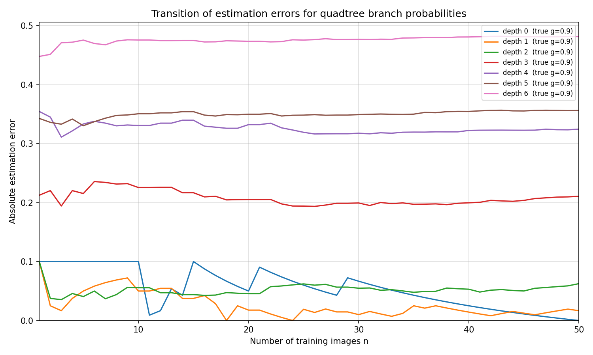

    - ### [exp.2.1.2]

        | 深さ | 0 | 1 | 2 | 3 | 4 | 5 | 6 | 7 |
        |---|---:|---:|---:|---:|---:|---:|---:|---:|
        | パラメータ $g_s$ | 0.5 | 0.5 | 0.5 | 0.5 | 0.5 | 0.5 | 0.5 | 0 |

        - 生成された四分木と画像

            |  | sample(1) | sample(2) | sample(3) |
            |---|---|---|---|
            | 生成した画像 | 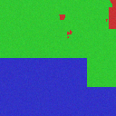 | 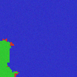 | 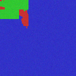 |
            | 真のラベル |  |  |  |
            | 真の統合領域 |  |  |  |
            | 真の四分木 | 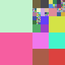 | 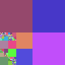 | 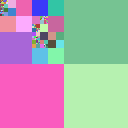 |
            | 推定時にラベルから構築した四分木 | 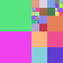 | 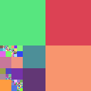 | 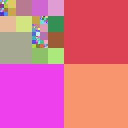 |

        - 推定されたパラメータ$g_s$
          - 学習データ数: 50組
          - パラメータの推定結果

          | 深さ | 0 | 1 | 2 | 3 | 4 | 5 | 6 | 7 |
          |---|---:|---:|---:|---:|---:|---:|---:|---:|
          | 推定値 $\hat{g}_s$ | 0.6400 | 0.4531 | 0.4659 | 0.4398 | 0.4979 | 0.4157 | 0.3466 | 0.0000 |
          | 推定誤差 $\hat{g}_s-g_s$ | 0.1400 | 0.0469 | 0.0341 | 0.0602 | 0.0021 | 0.0843 | 0.1534 | 0.0000 |
        
        - 学習枚数ごとの推定誤差の推移

          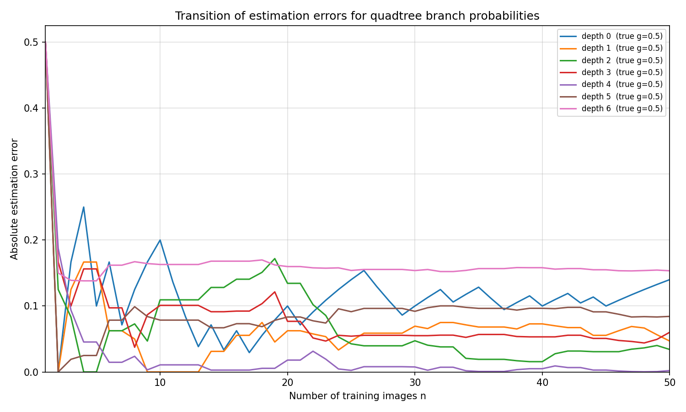

    - ### [exp. 2.1.3]

        | 深さ | 0 | 1 | 2 | 3 | 4 | 5 | 6 | 7 |
        |---|---:|---:|---:|---:|---:|---:|---:|---:|
        | パラメータ $g_s$ | 0.9 | 0.8 | 0.7 | 0.6 | 0.5 | 0.4 | 0.3 | 0 |

        - 生成された四分木と画像

          |  | sample(1) | sample(2) | sample(3) |
          |---|---|---|---|
          | 生成した画像 | 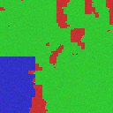 | 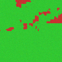 |  |
          | 真のラベル |  |  |  |
          | 真の統合領域 |  |  | 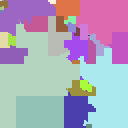 |
          | 真の四分木 | 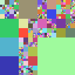 | 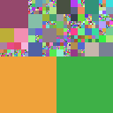 | 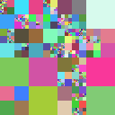 |
          | 推定時にラベルから構築した四分木 | 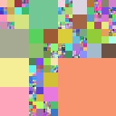 | 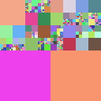 | 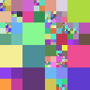 |

        - 推定されたパラメータ$g_s$
          - 学習データ数: 50組
          - パラメータの推定結果

          | 深さ | 0 | 1 | 2 | 3 | 4 | 5 | 6 | 7 |
          |---|---:|---:|---:|---:|---:|---:|---:|---:|
          | 推定値 $\hat{g}_s$ | 0.9000 | 0.8167 | 0.6518 | 0.5171 | 0.4231 | 0.3327 | 0.2174 | 0.0000 |
          | 推定誤差 $\hat{g}_s-g_s$ | 0.0000 | 0.0167 | 0.0482 | 0.0829 | 0.0769 | 0.0673 | 0.0826 | 0.0000 |
        
        - 学習枚数ごとの推定誤差の推移

          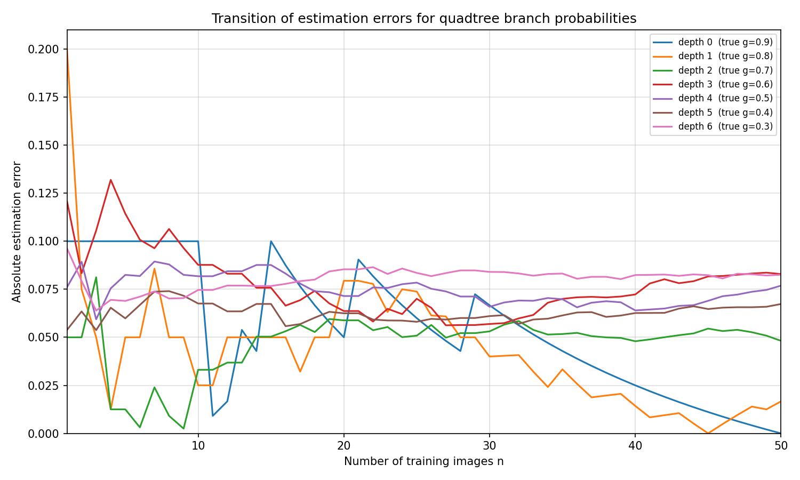

    - ### [exp. 2.1.4]

        | 深さ | 0 | 1 | 2 | 3 | 4 | 5 | 6 | 7 |
        |---|---:|---:|---:|---:|---:|---:|---:|---:|
        | パラメータ $g_s$ | 0.9 | 0.9 | 0.9 | 0.5 | 0.5 | 0.5 | 0.5 | 0 |

        - 生成された四分木と画像

          |  | sample(1) | sample(2) | sample(3) |
          |---|---|---|---|
          | 生成した画像 | 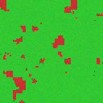 | 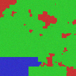 | 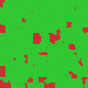 |
          | 真のラベル |  |  |  |
          | 真の統合領域 |  |  | 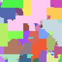 |
          | 真の四分木 | 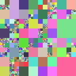 | 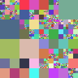 | 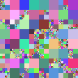 |
          | 推定時にラベルから構築した四分木 | 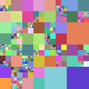 | 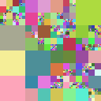 | 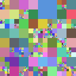 |

        - 推定されたパラメータ$g_s$
          - 学習データ数: 50組
          - パラメータの推定結果

          | 深さ | 0 | 1 | 2 | 3 | 4 | 5 | 6 | 7 |
          |---|---:|---:|---:|---:|---:|---:|---:|---:|
          | 推定値 $\hat{g}_s$ | 0.9000 | 0.8778 | 0.7878 | 0.4608 | 0.4637 | 0.4102 | 0.3268 | 0.0000 |
          | 推定誤差 $\hat{g}_s-g_s$ | 0.0000 | 0.0222 | 0.1122 | 0.0392 | 0.0363 | 0.0898 | 0.1732 | 0.0000 |
        
        - 学習枚数ごとの推定誤差の推移

          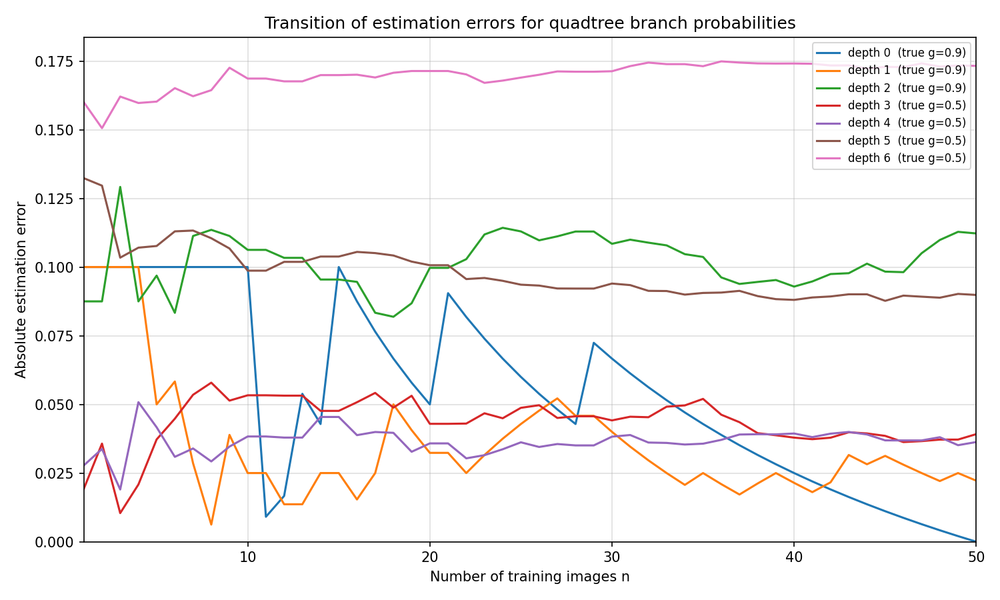

### 2.2 発生させた人工データからラベルの事前分布のパラメータを推定

- 四分木は以下の事前分布をもとに発生させる．
    $$
    p(T;\mathbf{g})=\prod_{s\in \mathcal{L}(T)}(1-g_s)\prod_{s'\in \mathcal{I}(T)}g_{s'}
    $$

    設定したパラメータ:

    | 深さ | 0 | 1 | 2 | 3 | 4 | 5 | 6 | 7 |
    |---|---:|---:|---:|---:|---:|---:|---:|---:|
    | パラメータ $g_s$ | 0.9 | 0.8 | 0.7 | 0.6 | 0.5 | 0.4 | 0.3 | 0 |

- 統合領域は以下の事前分布をもとに発生させる．

    $$
    p(c_s=s'\mid T;\alpha,\beta,\eta)\propto
    \begin{cases}
    \dfrac{f(s,s')}{\alpha+\sum_{s''\in \mathcal{L}(T)\setminus\{s\}}f(s,s'')} & (s\neq s')\\
    \dfrac{\alpha}{\alpha+\sum_{s''\in \mathcal{L}(T)\setminus\{s\}}f(s,s'')} & (s=s')
    \end{cases}
    $$

    $$
    f(s,s')=
    \begin{cases}
    \exp\left(\beta B(s,s')+\eta(\mathrm{depth}(s)-\mathrm{depth}(s'))\right) & (\text{$s$と$s'$が隣接している})\\
    0 & (\text{$s$と$s'$が隣接していない})
    \end{cases}
    $$

    設定したパラメータ:

    - $\alpha = 1.0\times 10^{-8}$
    - $\beta=8.0$
    - $\eta=8.0$

- ピクセル値は以下の尤度関数に従って生成する．

    $$
        p(Y_r\mid x_r;\boldsymbol{\mu}_{x_r},  \Sigma_{x_r})= \prod_{(i,j)\in r} p\bigl(y_{(i,j)};\boldsymbol{\mu}_{x_r},  \Sigma_{x_r}\bigr) 
    $$
    $$
        y_{(i,j)} \sim N^3(\boldsymbol{\mu}_{x_r},  \Sigma_{x_r})
    $$

    設定したパラメータ:

    | | $\bm{\mu}_x$ | $\Sigma_x$ | 
    |---|---|---|
    | $x=0$ | $\begin{bmatrix}200\\50\\50\end{bmatrix}$ | $\begin{bmatrix}20&0&0\\0&20&0\\0&0&20\end{bmatrix}$ |
    | $x=1$ | $\begin{bmatrix}50\\200\\50\end{bmatrix}$ | $\begin{bmatrix}20&0&0\\0&20&0\\0&0&20\end{bmatrix}$ |
    | $x=2$ | $\begin{bmatrix}50\\50\\200\end{bmatrix}$ | $\begin{bmatrix}20&0&0\\0&20&0\\0&0&20\end{bmatrix}$ |

#### 2.2.1 幾何学的特徴量の分布が正規分布に従うことを仮定したときのラベルの事前分布のパラメータ推定

### [exp.2.2.1]

- 以下の事前分布に従ってラベルを生成する．

  $$p(\phi_i(r)\mid x_r=x) =\mathcal{N} \left(\phi_i(r);m_i^{(x)},\left(\sigma_i^{(x)}\right)^2\right)$$
  $$p\left(\boldsymbol{\phi}(r)\mid x_r=x\right) =
  \prod_{i=1}^{|\bm{\phi}|}
  p(\phi_i(r)\mid x_r=x)$$
  $$p(x_r=x) = 
  \frac{
  p\left(\boldsymbol{\phi}(r)\mid x_r=x\right)
  }{
  \sum\limits_{x'\in\mathcal{X}}
  p\left(\boldsymbol{\phi}(r)\mid x_r=x'\right)
  }$$

- 設定したパラメータ

  | | $x=0$ | $x=1$ | $x=2$ |
  |---|---:|---:|---:|
  | log Area: $(m_1^{(x)}, \sigma_1^{(x)})$ | $(4.0, 1.0)$ | $(6.5,1.5)$ | $(9.0, 1.0)$  |
  | log Perimeter: $(m_2^{(x)}, \sigma_2^{(x)})$ | $(3.5, 0.5)$ | $(5, 0.5)$ | $(6, 0.5)$ |
  | Circularity: $(m_3^{(x)}, \sigma_3^{(x)})$ | $(0.45, 0.2)$ | $(0.5, 0.1)$ | $(0.7, 0.1)$ |

- 生成したデータは以下の通り．(データ数: 50組)

  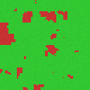
  
  
  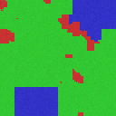
  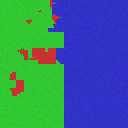

  
  
  
  
  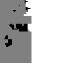

  ラベルデータから構築された領域(統合領域):

  
  
  
  
  

  パラメータ推定時にラベルデータから抽出された領域:

  
  
  
  
  

- パラメータの推定値と推定誤差

  | | $x=0$ | $x=1$ | $x=2$ |
  |---|---:|---:|---:|
  | (推定値) log Area: $(\hat{m}_1^{(x)}, \hat{\sigma}_1^{(x)})$ | $(4.7166, 0.7890)$ | $(9.1111, 0.9933)$ | $(8.7701, 0.8132)$ |
  | (推定誤差) log Area: $(\hat{m}_1^{(x)}-m_1^{(x)}, \hat{\sigma}_1^{(x)}-\sigma_1^{(x)})$ | $(0.7166, -0.2110)$ | $(2.6111, -0.5067)$ | $(-0.2299, -0.1868)$ |
  | (推定値) log Perimeter: $(\hat{m}_2^{(x)}, \hat{\sigma}_2^{(x)})$ | $(4.0576, 0.4965)$ | $(6.6745, 0.6532)$ | $(5.9444, 0.3994)$ |
  | (推定誤差) log Perimeter: $(\hat{m}_2^{(x)}-m_2^{(x)}, \hat{\sigma}_2^{(x)}-\sigma_2^{(x)})$ | $(0.5576, -0.0035)$ | $(1.6745, 0.1532)$ | $(-0.0556, -0.1006)$ |
  | (推定値) Circularity: $(\hat{m}_3^{(x)}, \hat{\sigma}_3^{(x)})$ | $(0.4555, 0.1426)$ | $(0.1995, 0.1013)$ | $(0.5730, 0.1358)$ |
  | (推定誤差) Circularity: $(\hat{m}_3^{(x)}-m_3^{(x)}, \hat{\sigma}_3^{(x)}-\sigma_3^{(x)})$ | $(0.0055, -0.0574)$ | $(-0.3005, 0.0013)$ | $(-0.1270, 0.0358)$ |

- パラメータの推定誤差の推移

  - テキストデータ（1組目から50組目までの推定推移）:
    `./exp.2.2.1/outputs/estimation_results/label_param_trajectory.tsv`

  - $m$ の推定誤差推移:

    

  - $\sigma$ の推定誤差推移:

    

#### 2.2.2 幾何学的特徴量からロジスティック回帰モデルに従ってラベルが発生するモデルを仮定したときのラベルの事前分布のパラメータ推定

### [exp.2.2.2] 

- 以下の事前分布に従ってラベルを発生させる．

  $$
  p(x_r = x;\bm{\omega}) =\frac{\exp \left( {\bm{\omega}^{(x)}}^{\top} \bm{\phi}(r) \right)}{\sum_{x'\in X} \exp \left( {\bm{\omega}^{(x')}}^{\top} \bm{\phi}(r) \right)}
  $$

- 設定したパラメータ

  | | $x=0$ | $x=1$ | $x=2$ |
  |---|---:|---:|---:|
  | bias: $\omega_0^{(x)}$ | $6.5$ | $-4.5$ | $-31.0$ |
  | log Area: $\omega_1^{(x)}$ | $-1.4$ | $0.1$ | $2.4$ |
  | log Perimeter: $\omega_2^{(x)}$ | $-0.9$ | $1.0$ | $1.8$ |
  | Circularity: $\omega_3^{(x)}$ | $2.8$ | $-2.5$ | $1.5$ |

- 生成したデータは以下の通り(データ数: 50組)

  
  
  
  
  

  
  
  
  
  

  ラベルデータから構築された領域(統合領域):

  
  
  
  
  

  パラメータ推定時にラベルデータから抽出された領域:

  
  
  
  
  

- パラメータの推定値と推定誤差

  | | $x=0$ | $x=1$ | $x=2$ |
  |---|---:|---:|---:|
  | (推定値) bias: $\hat{\omega}_0^{(x)}$ | $-17.5131$ | $-5.8859$ | $23.3990$ |
  | (推定誤差) bias: $\hat{\omega}_0^{(x)}-\omega_0^{(x)}$ | $-24.0131$ | $-1.3859$ | $54.3990$ |
  | (推定値) log Area: $\hat{\omega}_1^{(x)}$ | $-8.6225$ | $-0.2803$ | $8.9028$ |
  | (推定誤差) log Area: $\hat{\omega}_1^{(x)}-\omega_1^{(x)}$ | $-7.2225$ | $-0.3803$ | $6.5028$ |
  | (推定値) log Perimeter: $\hat{\omega}_2^{(x)}$ | $13.6559$ | $1.7571$ | $-15.4130$ |
  | (推定誤差) log Perimeter: $\hat{\omega}_2^{(x)}-\omega_2^{(x)}$ | $14.5559$ | $0.7571$ | $-17.2130$ |
  | (推定値) Circularity: $\hat{\omega}_3^{(x)}$ | $13.6029$ | $-1.9507$ | $-11.6522$ |
  | (推定誤差) Circularity: $\hat{\omega}_3^{(x)}-\omega_3^{(x)}$ | $10.8029$ | $0.5493$ | $-13.1522$ |

  > **注**: 多項ロジスティック回帰モデルはクラスによらず全パラメータに定数を加算しても確率値が変わらない（softmax の不変性）ため, パラメータは定数シフト分だけ不可識別である. L2 正則化によって推定値はゼロ付近に固定されるが, 真値が非ゼロ平均であるため, 推定誤差は定数シフトの分だけかさ上げされる.

- パラメータの推定誤差の推移

  - テキストデータ（1組目から50組目までの推定推移）:
    `./exp.2.2.2/outputs/estimation_results/label_param_trajectory.tsv`

  - $\omega$ の推定誤差推移:

    

## 3. セグメンテーションアルゴリズムの正確性とセグメンテーション結果の特徴を精査することを目的とした実験

### 3.1 生成モデルから発生した画像に対するセグメンテーション結果

- 画像生成時の設定
  
  - 四分木の事前分布のパラメータ
    $$
    p(T;\mathbf{g})=\prod_{s\in \mathcal{L}(T)}(1-g_s)\prod_{s'\in \mathcal{I}(T)}g_{s'}
    $$

  - 設定したパラメータ

    | 深さ | 0 | 1 | 2 | 3 | 4 | 5 | 6 | 7 |
    |---|---:|---:|---:|---:|---:|---:|---:|---:|
    | パラメータ $g_s$ | 0.9 | 0.8 | 0.7 | 0.6 | 0.5 | 0.4 | 0.3 | 0 |

  - 統合領域の事前分布とパラメータ
      - 事前分布の確率関数

          $$
          p(c_s=s'\mid T;\alpha,\beta,\eta)\propto
          \begin{cases}
          \dfrac{f(s,s')}{\alpha+\sum_{s''\in \mathcal{L}(T)\setminus\{s\}}f(s,s'')} & (s\neq s')\\
          \dfrac{\alpha}{\alpha+\sum_{s''\in \mathcal{L}(T)\setminus\{s\}}f(s,s'')} & (s=s')
          \end{cases}
          $$

          $$
          f(s,s')=
          \begin{cases}
          \exp\left(\beta B(s,s')+\eta(\mathrm{depth}(s)-\mathrm{depth}(s'))\right) & (\text{$s$と$s'$が隣接している})\\
          0 & (\text{$s$と$s'$が隣接していない})
          \end{cases}
          $$
      - 設定したパラメータ
          - $\alpha = 1.0\times 10^{-8}$
          - $\beta=8.0$
          - $\eta=8.0$

  - ラベルの事前分布とパラメータ

      - 幾何学的特徴量の正規確率に基づくラベルの発生モデル

          $$p(\phi_i(r)\mid x_r=x) =\mathcal{N} \left(\phi_i(r);m_i^{(x)},\left(\sigma_i^{(x)}\right)^2\right)$$
          $$p\left(\boldsymbol{\phi}(r)\mid x_r=x\right) =
          \prod_{i=1}^{|\bm{\phi}|}
          p(\phi_i(r)\mid x_r=x)$$
          $$p(x_r=x) = 
          \frac{
          p\left(\boldsymbol{\phi}(r)\mid x_r=x\right)
          }{
          \sum\limits_{x'\in\mathcal{X}}
          p\left(\boldsymbol{\phi}(r)\mid x_r=x'\right)
          }$$

      - 設定したパラメータ

        | | $x=0$ | $x=1$ | $x=2$ |
        |---|---:|---:|---:|
        | log Area: $(m_1^{(x)}, \sigma_1^{(x)})$ | $(4.0, 1.0)$ | $(6.5,1.5)$ | $(9.0, 1.0)$  |
        | log Perimeter: $(m_2^{(x)}, \sigma_2^{(x)})$ | $(3.5, 0.5)$ | $(5, 0.5)$ | $(6, 0.5)$ |
        | Circularity: $(m_3^{(x)}, \sigma_3^{(x)})$ | $(0.45, 0.2)$ | $(0.5, 0.1)$ | $(0.7, 0.1)$ |

  - ピクセル値の尤度関数のパラメータ

      - ピクセル値の尤度関数
          $$
             p(Y_r\mid x_r;\boldsymbol{\mu}_{x_r},  \Sigma_{x_r})= \prod_{(i,j)\in r} p\bigl(y_{(i,j)};\boldsymbol{\mu}_{x_r},  \Sigma_{x_r}\bigr) 
          $$
          $$
              y_{(i,j)} \sim N^3(\boldsymbol{\mu}_{x_r},  \Sigma_{x_r})
          $$

      - 設定したパラメータ
        | | $\bm{\mu}_x$ | $\Sigma_x$ | 
        |---|---|---|
        | $x=0$ | $\begin{bmatrix}200\\50\\50\end{bmatrix}$ | $\begin{bmatrix}20&0&0\\0&20&0\\0&0&20\end{bmatrix}$ |
        | $x=1$ | $\begin{bmatrix}50\\200\\50\end{bmatrix}$ | $\begin{bmatrix}20&0&0\\0&20&0\\0&0&20\end{bmatrix}$ |
        | $x=2$ | $\begin{bmatrix}50\\50\\200\end{bmatrix}$ | $\begin{bmatrix}20&0&0\\0&20&0\\0&0&20\end{bmatrix}$ |

### [exp.3.1.1]

- テストデータに対するセグメンテーション結果を以下に示す．

##### `sample_0000`

<table>
  <tr>
    <th>推定対象画像</th>
    <th>真のラベル</th>
  </tr>
  <tr>
    <td></td>
    <td></td>
  </tr>
</table>

<table>
  <tr>
    <th>MAP木</th>
  </tr>
  <tr>
    <td></td>
  </tr>
</table>

<table>
  <tr>
    <th></th>
    <th>統合領域</th>
    <th>推定ラベル</th>
    <th>真のラベルとの差分</th>
  </tr>
  <tr>
    <th>ギブス1回目</th>
    <td></td>
    <td></td>
    <td></td>
  </tr>
  <tr>
    <th>ギブス2回目</th>
    <td></td>
    <td></td>
    <td></td>
  </tr>
  <tr>
    <th>ギブス3回目</th>
    <td></td>
    <td></td>
    <td></td>
  </tr>
  <tr>
    <th>ギブス4回目</th>
    <td></td>
    <td></td>
    <td></td>
  </tr>
  <tr>
    <th>ギブス5回目</th>
    <td></td>
    <td></td>
    <td></td>
  </tr>
</table>

##### `sample_0001`

<table>
  <tr>
    <th>推定対象画像</th>
    <th>真のラベル</th>
  </tr>
  <tr>
    <td></td>
    <td></td>
  </tr>
</table>

<table>
  <tr>
    <th>MAP木</th>
  </tr>
  <tr>
    <td></td>
  </tr>
</table>

<table>
  <tr>
    <th></th>
    <th>統合領域</th>
    <th>推定ラベル</th>
    <th>真のラベルとの差分</th>
  </tr>
  <tr>
    <th>ギブス1回目</th>
    <td></td>
    <td></td>
    <td></td>
  </tr>
  <tr>
    <th>ギブス2回目</th>
    <td></td>
    <td></td>
    <td></td>
  </tr>
  <tr>
    <th>ギブス3回目</th>
    <td></td>
    <td></td>
    <td></td>
  </tr>
  <tr>
    <th>ギブス4回目</th>
    <td></td>
    <td></td>
    <td></td>
  </tr>
  <tr>
    <th>ギブス5回目</th>
    <td></td>
    <td></td>
    <td></td>
  </tr>
</table>

##### `sample_0002`

<table>
  <tr>
    <th>推定対象画像</th>
    <th>真のラベル</th>
  </tr>
  <tr>
    <td></td>
    <td></td>
  </tr>
</table>

<table>
  <tr>
    <th>MAP木</th>
  </tr>
  <tr>
    <td></td>
  </tr>
</table>

<table>
  <tr>
    <th></th>
    <th>統合領域</th>
    <th>推定ラベル</th>
    <th>真のラベルとの差分</th>
  </tr>
  <tr>
    <th>ギブス1回目</th>
    <td></td>
    <td></td>
    <td></td>
  </tr>
  <tr>
    <th>ギブス2回目</th>
    <td></td>
    <td></td>
    <td></td>
  </tr>
  <tr>
    <th>ギブス3回目</th>
    <td></td>
    <td></td>
    <td></td>
  </tr>
  <tr>
    <th>ギブス4回目</th>
    <td></td>
    <td></td>
    <td></td>
  </tr>
  <tr>
    <th>ギブス5回目</th>
    <td></td>
    <td></td>
    <td></td>
  </tr>
</table>

## 4. 合成データの実験結果

### [exp.4]

- `exp.4/make_syn_data2.py` を用いて，$256\times 256$ の合成画像データを作成した．

- 学習データ数は100枚，テストデータ数は5枚である．

- ラベル集合は $\mathcal{X}=\{0,1,2\}$ とし，それぞれ背景，矩形，円に対応する．

#### 4.1 作成した画像データとラベルデータ

- 学習データの代表例を以下に示す．各セルの上段が生成画像，下段が対応するラベルの可視化画像である．

    <table>
      <tr>
        <th>`train_000`</th>
        <th>`train_001`</th>
        <th>`train_002`</th>
        <th>`train_003`</th>
        <th>`train_004`</th>
      </tr>
      <tr>
        <td>
          
          
        </td>
        <td>
          
          
        </td>
        <td>
          
          
        </td>
        <td>
          
          
        </td>
        <td>
          
          
        </td>
      </tr>
    </table>

#### 4.2 推定したパラメータ

- 四分木の事前分布は以下を仮定する．

    $$
    p(T;\mathbf{g})=\prod_{s\in \mathcal{L}(T)}(1-g_s)\prod_{s'\in \mathcal{I}(T)}g_{s'}
    $$

- ラベルの事前分布は以下を仮定する．

    $$
    p(x_r = x;\bm{\omega}) =\frac{\exp \left( {\bm{\omega}^{(x)}}^{\top} \bm{\phi}(r) \right)}{\sum_{x'\in X} \exp \left( {\bm{\omega}^{(x')}}^{\top} \bm{\phi}(r) \right)}
    $$

- ピクセル値の尤度関数は以下を仮定する．

    $$
    p(Y_r\mid x_{r};\bm{\theta}) = p(Y_r;\bm{\theta}_{x_{r}})
    $$
    $$
    p(Y_r\mid x_r;\boldsymbol{\mu}_{x_r},  \Sigma_{x_r})= \prod_{(i,j)\in r} p\bigl(y_{(i,j)};\boldsymbol{\mu}_{x_r},  \Sigma_{x_r}\bigr)
    $$
    $$
    y_{(i,j)} \sim N(\mu_{x_r}, \sigma_{x_r}^2)
    $$

- 推定されたパラメータは以下の通りである．

    - 四分木事前分布パラメータ $\hat{\bm{g}}$

      | 深さ $d$ | 0 | 1 | 2 | 3 | 4 | 5 | 6 | 7 | 8 |
      |---|---:|---:|---:|---:|---:|---:|---:|---:|---:|
      | $\hat{g}_d$ | 1.0000 | 0.9850 | 0.7334 | 0.5333 | 0.5128 | 0.4794 | 0.4344 | 0.3342 | 0 |

    - ラベル事前分布パラメータ $\hat{\bm{\omega}}$

      | | $x=0$ | $x=1$ | $x=2$ |
      |---|---:|---:|---:|
      | bias: $\hat{\omega}_0^{(x)}$ | $-95.1724$ | $77.4324$ | $17.7400$ |
      | log Area: $\hat{\omega}_1^{(x)}$ | $6.1112$ | $-6.5004$ | $0.3892$ |
      | log Perimeter: $\hat{\omega}_2^{(x)}$ | $5.7695$ | $-3.4069$ | $-2.3627$ |
      | Circularity: $\hat{\omega}_3^{(x)}$ | $-1.9461$ | $0.2563$ | $1.6898$ |

    - ピクセル値分布パラメータ $\hat{\bm{\theta}}$

      | | $x=0$ | $x=1$ | $x=2$ |
      |---|---:|---:|---:|
      | 平均 $\hat{\mu}_x$ | $101.5950$ | $149.5399$ | $149.5123$ |
      | 標準偏差 $\hat{\sigma}_x$ | $64.4662$ | $19.9764$ | $20.0134$ |

#### 4.3 テストデータに対する推定結果

- 以下では `test_001.png` の結果に絞って，MAP木とギブスサンプリングの全反復結果を示す．

##### `test_001`

<table>
  <tr>
    <th>推定対象画像</th>
    <th>真のラベル</th>
  </tr>
  <tr>
    <td></td>
    <td></td>
  </tr>
</table>

<table>
  <tr>
    <th>MAP木</th>
  </tr>
  <tr>
    <td></td>
  </tr>
</table>

<table>
  <tr>
    <th></th>
    <th>統合領域</th>
    <th>推定ラベル</th>
    <th>真のラベルとの差分</th>
  </tr>
  <tr>
    <th>ギブス1回目</th>
    <td></td>
    <td></td>
    <td></td>
  </tr>
  <tr>
    <th>ギブス2回目</th>
    <td></td>
    <td></td>
    <td></td>
  </tr>
  <tr>
    <th>ギブス3回目</th>
    <td></td>
    <td></td>
    <td></td>
  </tr>
  <tr>
    <th>ギブス4回目</th>
    <td></td>
    <td></td>
    <td></td>
  </tr>
  <tr>
    <th>ギブス5回目</th>
    <td></td>
    <td></td>
    <td></td>
  </tr>
  <tr>
    <th>ギブス6回目</th>
    <td></td>
    <td></td>
    <td></td>
  </tr>
  <tr>
    <th>ギブス7回目</th>
    <td></td>
    <td></td>
    <td></td>
  </tr>
  <tr>
    <th>ギブス8回目</th>
    <td></td>
    <td></td>
    <td></td>
  </tr>
  <tr>
    <th>ギブス9回目</th>
    <td></td>
    <td></td>
    <td></td>
  </tr>
  <tr>
    <th>ギブス10回目</th>
    <td></td>
    <td></td>
    <td></td>
  </tr>
  <tr>
    <th>ギブス11回目</th>
    <td></td>
    <td></td>
    <td></td>
  </tr>
  <tr>
    <th>ギブス12回目</th>
    <td></td>
    <td></td>
    <td></td>
  </tr>
  <tr>
    <th>ギブス13回目</th>
    <td></td>
    <td></td>
    <td></td>
  </tr>
  <tr>
    <th>ギブス14回目</th>
    <td></td>
    <td></td>
    <td></td>
  </tr>
  <tr>
    <th>ギブス15回目</th>
    <td></td>
    <td></td>
    <td></td>
  </tr>
  <tr>
    <th>ギブス16回目</th>
    <td></td>
    <td></td>
    <td></td>
  </tr>
  <tr>
    <th>ギブス17回目</th>
    <td></td>
    <td></td>
    <td></td>
  </tr>
  <tr>
    <th>ギブス18回目</th>
    <td></td>
    <td></td>
    <td></td>
  </tr>
  <tr>
    <th>ギブス19回目</th>
    <td></td>
    <td></td>
    <td></td>
  </tr>
  <tr>
    <th>ギブス20回目</th>
    <td></td>
    <td></td>
    <td></td>
  </tr>
</table>

## 5. 合成データの実験part2