# ISITA2026に向けた実験報告

この資料はISITA2026投稿に向けた実験結果または今後実験をする予定の事項を報告するものである．

実験が完了している事項には適宜実験結果を記載しており，結果が未記載の箇所はこれから実験予定とする事項である．

## 1. 仮定した確率的生成モデルの挙動や表現力を確認することを目的とした実験

### 1.1 四分木の事前分布
- 事前分布の確率関数
    $$
    p(T;\mathbf{g})=\prod_{s\in \mathcal{L}(T)}(1-g_s)\prod_{s'\in \mathcal{I}(T)}g_{s'}
    $$

- 深さごとに以下のようなパラメータ$g_s$を設定し，生成される四分木と出現する葉ノードの深さの分布を調査する．

    - 全ノード共通のパラメータを設定

        ### [exp. 1.1.1]

        | 深さ | 0 | 1 | 2 | 3 | 4 | 5 | 6 | 7 |
        |---|---:|---:|---:|---:|---:|---:|---:|---:|
        | パラメータ $g_s$ | 0.9 | 0.9 | 0.9 | 0.9 | 0.9 | 0.9 | 0.9 | 0 |

        - 生成された四分木

            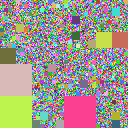 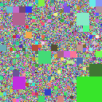 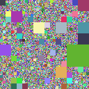 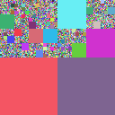 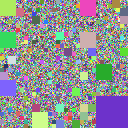

        - 出現する葉ノードの深さの分布

            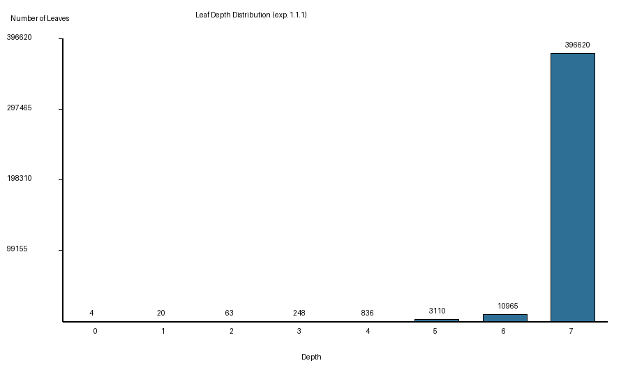

        ### [exp. 1.1.2]

        | 深さ | 0 | 1 | 2 | 3 | 4 | 5 | 6 | 7 |
        |---|---:|---:|---:|---:|---:|---:|---:|---:|
        | パラメータ $g_s$ | 0.5 | 0.5 | 0.5 | 0.5 | 0.5 | 0.5 | 0.5 | 0 |

        - 生成された四分木

            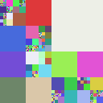  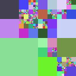  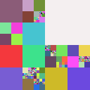

        - 出現する葉ノードの深さの分布

            

    - ノードの深さが深くなるほどパラメータの値が小さくなるように設定

        ### [exp. 1.1.3]

        | 深さ | 0 | 1 | 2 | 3 | 4 | 5 | 6 | 7 |
        |---|---:|---:|---:|---:|---:|---:|---:|---:|
        | パラメータ $g_s$ | 0.9 | 0.8 | 0.7 | 0.6 | 0.5 | 0.4 | 0.3 | 0 |

        - 生成された四分木

            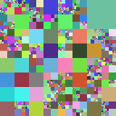 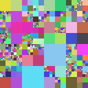 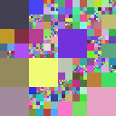 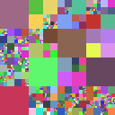 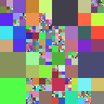

        - 出現する葉ノードの深さの分布

            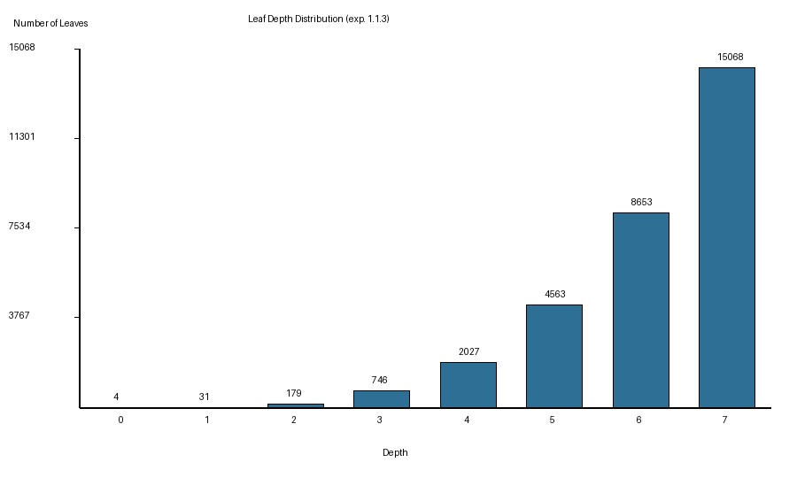

        (exp. 1.1.4)

        | 深さ | 0 | 1 | 2 | 3 | 4 | 5 | 6 | 7 |
        |---|---:|---:|---:|---:|---:|---:|---:|---:|
        | パラメータ $g_s$ | 0.9 | 0.9 | 0.9 | 0.5 | 0.5 | 0.5 | 0.5 | 0 |

        - 生成された四分木

            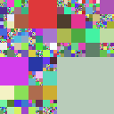 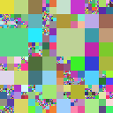 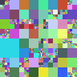 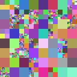 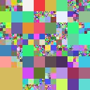

        - 出現する葉ノードの深さの分布

            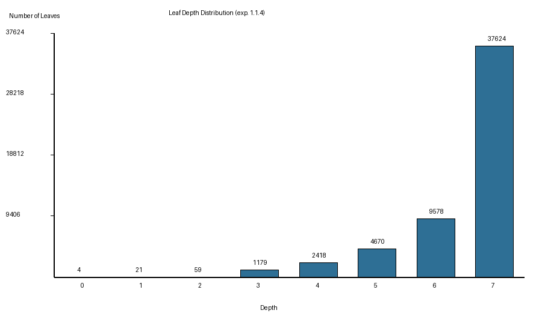

- 考察

### 1.2 領域の事前分布

- 統合領域の事前分布: ddCRPモデル

    $$
    p(c_s=s'\mid T;\alpha,\beta,\eta)\propto
    \begin{cases}
    \dfrac{f(s,s')}{\alpha+\sum_{s''\in \mathcal{L}(T)\setminus\{s\}}f(s,s'')} & (s\neq s')\\
    \dfrac{\alpha}{\alpha+\sum_{s''\in \mathcal{L}(T)\setminus\{s\}}f(s,s'')} & (s=s')
    \end{cases}
    $$

    ここで，親和度関数$f(s, s')$は以下のように設定している:

    $$
    f(s,s')=
    \begin{cases}
    \exp\left(\beta B(s,s')+\eta(\mathrm{depth}(s)-\mathrm{depth}(s'))\right) & (\text{$s$と$s'$が隣接している})\\
    0 & (\text{$s$と$s'$が隣接していない})
    \end{cases}
    $$

- パラメータ$\alpha,\beta,\eta$を変化させることで，生成される統合領域の特徴の変化を調査する．

    パラメータはそれぞれ3パターンずつ変化させる．

    - $\alpha = 1.0\times 10^{-8}, 1.0\times 10^{-4}, 1.0$

    - $\beta = 0, 8.0, 30.0$

    - $\eta = 0, 8.0, 30.0$

    また，生成された統合領域の幾何学的特徴量の分布を調べる．今回調査する幾何学的特徴量は以下の通り．

    - 面積

    - 周の長さ

    - 円形度

    ### [exp. 1.2.1]

    exp. 1.1.1で生成された以下の四分木を対象に統合領域を生成する．

    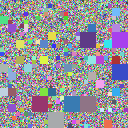

    - 生成された統合領域（各セルは代表例として region_000.png を掲載）

        <table>
          <tr>
            <th>&alpha; = 1.0</th>
            <th>&alpha; = 1.0 &times; 10-4</th>
            <th>&alpha; = 1.0 &times; 10-8</th>
          </tr>
          <tr>
            <td>
              <table>
                <tr><th></th><th>&eta; = 0</th><th>&eta; = 8.0</th><th>&eta; = 30.0</th></tr>
                <tr>
                  <th>&beta; = 0</th>
                  <td>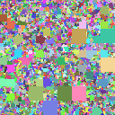</td>
                  <td>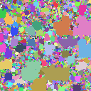</td>
                  <td>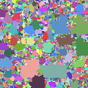</td>
                </tr>
                <tr>
                  <th>&beta; = 8.0</th>
                  <td>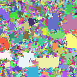</td>
                  <td>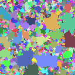</td>
                  <td>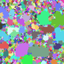</td>
                </tr>
                <tr>
                  <th>&beta; = 30.0</th>
                  <td>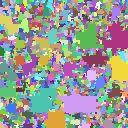</td>
                  <td>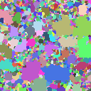</td>
                  <td>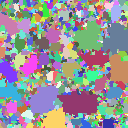</td>
                </tr>
              </table>
            </td>
            <td>
              <table>
                <tr><th></th><th>&eta; = 0</th><th>&eta; = 8.0</th><th>&eta; = 30.0</th></tr>
                <tr>
                  <th>&beta; = 0</th>
                  <td>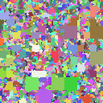</td>
                  <td>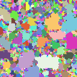</td>
                  <td>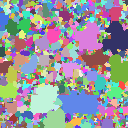</td>
                </tr>
                <tr>
                  <th>&beta; = 8.0</th>
                  <td>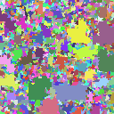</td>
                  <td>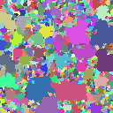</td>
                  <td>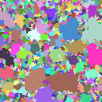</td>
                </tr>
                <tr>
                  <th>&beta; = 30.0</th>
                  <td>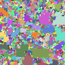</td>
                  <td>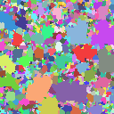</td>
                  <td>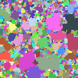</td>
                </tr>
              </table>
            </td>
            <td>
              <table>
                <tr><th></th><th>&eta; = 0</th><th>&eta; = 8.0</th><th>&eta; = 30.0</th></tr>
                <tr>
                  <th>&beta; = 0</th>
                  <td>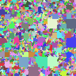</td>
                  <td>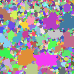</td>
                  <td>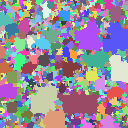</td>
                </tr>
                <tr>
                  <th>&beta; = 8.0</th>
                  <td>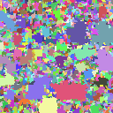</td>
                  <td>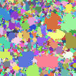</td>
                  <td>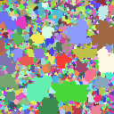</td>
                </tr>
                <tr>
                  <th>&beta; = 30.0</th>
                  <td>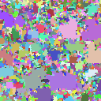</td>
                  <td>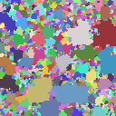</td>
                  <td>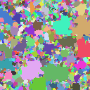</td>
                </tr>
              </table>
            </td>
          </tr>
        </table>

    - 生成された統合領域の幾何学的特徴量の分布

        - 面積

          
<strong>&alpha; = 1.0 &times; 10-8</strong>

          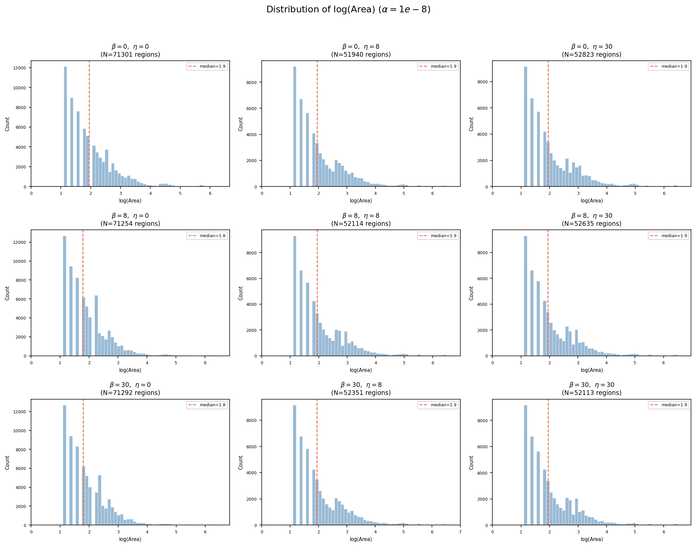

          
<strong>&alpha; = 1.0 &times; 10-4</strong>

          

          
<strong>&alpha; = 1.0</strong>

          

        - 周の長さ

          
<strong>&alpha; = 1.0 &times; 10-8</strong>

          

          
<strong>&alpha; = 1.0 &times; 10-4</strong>

          

          
<strong>&alpha; = 1.0</strong>

          

        - 円形度

          
<strong>&alpha; = 1.0 &times; 10-8</strong>

          

          
<strong>&alpha; = 1.0 &times; 10-4</strong>

          

          
<strong>&alpha; = 1.0</strong>

          

    ### [exp. 1.2.2]

    exp. 1.1.2で生成された以下の四分木を対象に統合領域を生成する．

    

    - 生成された統合領域（各セルは代表例として region_000.png を掲載）

        <table>
          <tr>
            <th>&alpha; = 1.0</th>
            <th>&alpha; = 1.0 &times; 10-4</th>
            <th>&alpha; = 1.0 &times; 10-8</th>
          </tr>
          <tr>
            <td>
              <table>
                <tr><th></th><th>&eta; = 0</th><th>&eta; = 8.0</th><th>&eta; = 30.0</th></tr>
                <tr>
                  <th>&beta; = 0</th>
                  <td></td>
                  <td></td>
                  <td></td>
                </tr>
                <tr>
                  <th>&beta; = 8.0</th>
                  <td></td>
                  <td></td>
                  <td></td>
                </tr>
                <tr>
                  <th>&beta; = 30.0</th>
                  <td></td>
                  <td></td>
                  <td></td>
                </tr>
              </table>
            </td>
            <td>
              <table>
                <tr><th></th><th>&eta; = 0</th><th>&eta; = 8.0</th><th>&eta; = 30.0</th></tr>
                <tr>
                  <th>&beta; = 0</th>
                  <td></td>
                  <td></td>
                  <td></td>
                </tr>
                <tr>
                  <th>&beta; = 8.0</th>
                  <td></td>
                  <td></td>
                  <td></td>
                </tr>
                <tr>
                  <th>&beta; = 30.0</th>
                  <td></td>
                  <td></td>
                  <td></td>
                </tr>
              </table>
            </td>
            <td>
              <table>
                <tr><th></th><th>&eta; = 0</th><th>&eta; = 8.0</th><th>&eta; = 30.0</th></tr>
                <tr>
                  <th>&beta; = 0</th>
                  <td></td>
                  <td></td>
                  <td></td>
                </tr>
                <tr>
                  <th>&beta; = 8.0</th>
                  <td></td>
                  <td></td>
                  <td></td>
                </tr>
                <tr>
                  <th>&beta; = 30.0</th>
                  <td></td>
                  <td></td>
                  <td></td>
                </tr>
              </table>
            </td>
          </tr>
        </table>

    - 生成された統合領域の幾何学的特徴量の分布

        - 面積

          
<strong>&alpha; = 1.0 &times; 10-8</strong>

          

          
<strong>&alpha; = 1.0 &times; 10-4</strong>

          

          
<strong>&alpha; = 1.0</strong>

          

        - 周の長さ

          
<strong>&alpha; = 1.0 &times; 10-8</strong>

          

          
<strong>&alpha; = 1.0 &times; 10-4</strong>

          

          
<strong>&alpha; = 1.0</strong>

          

        - 円形度

          
<strong>&alpha; = 1.0 &times; 10-8</strong>

          

          
<strong>&alpha; = 1.0 &times; 10-4</strong>

          

          
<strong>&alpha; = 1.0</strong>

          

    ### [exp. 1.2.3]

    exp. 1.1.3で生成された以下の四分木を対象に統合領域を生成する．

    

    - 生成された統合領域（各セルは代表例として region_000.png を掲載）

        <table>
          <tr>
            <th>&alpha; = 1.0</th>
            <th>&alpha; = 1.0 &times; 10-4</th>
            <th>&alpha; = 1.0 &times; 10-8</th>
          </tr>
          <tr>
            <td>
              <table>
                <tr><th></th><th>&eta; = 0</th><th>&eta; = 8.0</th><th>&eta; = 30.0</th></tr>
                <tr>
                  <th>&beta; = 0</th>
                  <td></td>
                  <td></td>
                  <td></td>
                </tr>
                <tr>
                  <th>&beta; = 8.0</th>
                  <td></td>
                  <td></td>
                  <td></td>
                </tr>
                <tr>
                  <th>&beta; = 30.0</th>
                  <td></td>
                  <td></td>
                  <td></td>
                </tr>
              </table>
            </td>
            <td>
              <table>
                <tr><th></th><th>&eta; = 0</th><th>&eta; = 8.0</th><th>&eta; = 30.0</th></tr>
                <tr>
                  <th>&beta; = 0</th>
                  <td></td>
                  <td></td>
                  <td></td>
                </tr>
                <tr>
                  <th>&beta; = 8.0</th>
                  <td></td>
                  <td></td>
                  <td></td>
                </tr>
                <tr>
                  <th>&beta; = 30.0</th>
                  <td></td>
                  <td></td>
                  <td></td>
                </tr>
              </table>
            </td>
            <td>
              <table>
                <tr><th></th><th>&eta; = 0</th><th>&eta; = 8.0</th><th>&eta; = 30.0</th></tr>
                <tr>
                  <th>&beta; = 0</th>
                  <td></td>
                  <td></td>
                  <td></td>
                </tr>
                <tr>
                  <th>&beta; = 8.0</th>
                  <td></td>
                  <td></td>
                  <td></td>
                </tr>
                <tr>
                  <th>&beta; = 30.0</th>
                  <td></td>
                  <td></td>
                  <td></td>
                </tr>
              </table>
            </td>
          </tr>
        </table>

    - 生成された統合領域の幾何学的特徴量の分布

        - 面積

          
<strong>&alpha; = 1.0 &times; 10-8</strong>

          

          
<strong>&alpha; = 1.0 &times; 10-4</strong>

          

          
<strong>&alpha; = 1.0</strong>

          

        - 周の長さ

          
<strong>&alpha; = 1.0 &times; 10-8</strong>

          

          
<strong>&alpha; = 1.0 &times; 10-4</strong>

          

          
<strong>&alpha; = 1.0</strong>

          

        - 円形度

          
<strong>&alpha; = 1.0 &times; 10-8</strong>

          

          
<strong>&alpha; = 1.0 &times; 10-4</strong>

          

          
<strong>&alpha; = 1.0</strong>

          

    ### [exp. 1.2.4]

    exp. 1.1.4で生成された以下の四分木を対象に統合領域を生成する．

    

    - 生成された統合領域（各セルは代表例として region_000.png を掲載）

        <table>
          <tr>
            <th>&alpha; = 1.0</th>
            <th>&alpha; = 1.0 &times; 10-4</th>
            <th>&alpha; = 1.0 &times; 10-8</th>
          </tr>
          <tr>
            <td>
              <table>
                <tr><th></th><th>&eta; = 0</th><th>&eta; = 8.0</th><th>&eta; = 30.0</th></tr>
                <tr>
                  <th>&beta; = 0</th>
                  <td></td>
                  <td></td>
                  <td></td>
                </tr>
                <tr>
                  <th>&beta; = 8.0</th>
                  <td></td>
                  <td></td>
                  <td></td>
                </tr>
                <tr>
                  <th>&beta; = 30.0</th>
                  <td></td>
                  <td></td>
                  <td></td>
                </tr>
              </table>
            </td>
            <td>
              <table>
                <tr><th></th><th>&eta; = 0</th><th>&eta; = 8.0</th><th>&eta; = 30.0</th></tr>
                <tr>
                  <th>&beta; = 0</th>
                  <td></td>
                  <td></td>
                  <td></td>
                </tr>
                <tr>
                  <th>&beta; = 8.0</th>
                  <td></td>
                  <td></td>
                  <td></td>
                </tr>
                <tr>
                  <th>&beta; = 30.0</th>
                  <td></td>
                  <td></td>
                  <td></td>
                </tr>
              </table>
            </td>
            <td>
              <table>
                <tr><th></th><th>&eta; = 0</th><th>&eta; = 8.0</th><th>&eta; = 30.0</th></tr>
                <tr>
                  <th>&beta; = 0</th>
                  <td></td>
                  <td></td>
                  <td></td>
                </tr>
                <tr>
                  <th>&beta; = 8.0</th>
                  <td></td>
                  <td></td>
                  <td></td>
                </tr>
                <tr>
                  <th>&beta; = 30.0</th>
                  <td></td>
                  <td></td>
                  <td></td>
                </tr>
              </table>
            </td>
          </tr>
        </table>

    - 生成された統合領域の幾何学的特徴量の分布

        - 面積

          
<strong>&alpha; = 1.0 &times; 10-8</strong>

          

          
<strong>&alpha; = 1.0 &times; 10-4</strong>

          

          
<strong>&alpha; = 1.0</strong>

          

        - 周の長さ

          
<strong>&alpha; = 1.0 &times; 10-8</strong>

          

          
<strong>&alpha; = 1.0 &times; 10-4</strong>

          

          
<strong>&alpha; = 1.0</strong>

          

        - 円形度

          
<strong>&alpha; = 1.0 &times; 10-8</strong>

          

          
<strong>&alpha; = 1.0 &times; 10-4</strong>

          

          
<strong>&alpha; = 1.0</strong>

          

- 考察
    

### 1.3 ラベルの事前分布

今回は，面積，周の長さ，円形度の3つの幾何学的特徴量から，統合領域$r\in R(\bm{c})$それぞれに対して独立にラベルが付与されるモデルを想定している．

$$p(X\mid R(\bm{c}))=\prod_{r\in R(\bm{c})}p(x_r).$$

$$\bm{\phi}(r) = (\phi_1(r), \phi_2(r), \phi_3(r)) = (\log(\text{Area}(r)), \log(\text{Perimeter}(r)), \text{Circularity}(r))$$

#### 1.3.1 幾何学的特徴量をもとに正規分布の確率の重みからラベルが発生するモデル

- $p(x_r)$を以下のように仮定する．

    $$z(\phi_i(r)\mid x_r=x) =\mathcal{N} \left(\phi_i(r);m_i^{(x)},\left(\sigma_i^{(x)}\right)^2\right)$$
    $$z\left(\boldsymbol{\phi}(r)\mid x_r=x\right) =
    \prod_{i=1}^{|\bm{\phi}|}
    z(\phi_i(r)\mid x_r=x)$$
    $$p(x_r=x) = 
    \frac{
    z\left(\boldsymbol{\phi}(r)\mid x_r=x\right)
    }{
    \sum\limits_{x'\in\mathcal{X}}
    z\left(\boldsymbol{\phi}(r)\mid x_r=x'\right)
    }$$

- 統合領域をもとにラベルを発生させ，各ラベルごとの特徴に沿うようにラベルが発生しているかを調査する．

    ### [exp 1.3.1.1]

    exp.1.2.3において，$\alpha = 1.0\times10^{-4}, \beta=8.0, \eta=8.0$で生成された以下の統合領域に対して，以下のパラメータを設定してラベルを発生させる．

    　

    | | $x=0$ | $x=1$ | $x=2$ |
    |---|---:|---:|---:|
    | log Area: $(m_1^{(x)}, \sigma_1^{(x)})$ | $(4.0, 1.0)$ | $(6.5,1.5)$ | $(9.0, 1.0)$  |
    | log Perimeter: $(m_2^{(x)}, \sigma_2^{(x)})$ | $(3.5, 0.5)$ | $(5, 0.5)$ | $(6, 0.5)$ |
    | Circularity: $(m_3^{(x)}, \sigma_3^{(x)})$ | $(0.45, 0.2)$ | $(0.5, 0.1)$ | $(0.7, 0.1)$ |

    発生させたラベル画像は以下の通り．

    - 領域番号ごとの特徴量と対応する事前確率

      | | region 1 | region 2 | region 3 | region 4 | region 5 | region 6 | region 7 | region 8 |
      |---|---|---|---|---|---|---|---|---|
      | $\phi_1$: log_area | 1.39 | 8.88 | 3.50 | 4.44 | 7.36 | 8.83 | 6.35 | 4.29 |
      | $z(\phi_1\|x_r=0)$ | 0.01 | 0.00 | 0.35 | 0.36 | 0.00 | 0.00 | 0.03 | 0.38 |
      | $z(\phi_1\|x_r=1)$ | 0.00 | 0.08 | 0.04 | 0.10 | 0.23 | 0.08 | 0.26 | 0.09 |
      | $z(\phi_1\|x_r=2)$ | 0.00 | 0.40 | 0.00 | 0.00 | 0.10 | 0.39 | 0.01 | 0.00 |
      | $\phi_2$: log_perimeter | 2.20 | 6.18 | 3.22 | 3.71 | 5.32 | 6.08 | 4.84 | 3.76 |
      | $z(\phi_2\|x_r=0)$ | 0.03 | 0.00 | 0.68 | 0.73 | 0.00 | 0.00 | 0.02 | 0.70 |
      | $z(\phi_2\|x_r=1)$ | 0.00 | 0.05 | 0.00 | 0.03 | 0.65 | 0.08 | 0.76 | 0.04 |
      | $z(\phi_2\|x_r=2)$ | 0.00 | 0.75 | 0.00 | 0.00 | 0.32 | 0.79 | 0.06 | 0.00 |
      | $\phi_3$: circularity | 0.59 | 0.39 | 0.70 | 0.66 | 0.47 | 0.45 | 0.45 | 0.51 |
      | $z(\phi_3\|x_r=0)$ | 1.57 | 1.92 | 0.92 | 1.15 | 1.98 | 1.99 | 1.99 | 1.90 |
      | $z(\phi_3\|x_r=1)$ | 2.68 | 2.26 | 0.56 | 1.11 | 3.85 | 3.57 | 3.53 | 3.96 |
      | $z(\phi_3\|x_r=2)$ | 2.16 | 0.04 | 3.99 | 3.68 | 0.30 | 0.19 | 0.18 | 0.69 |
      | $p(x_r=0)$ | 1.00 | 0.00 | 1.00 | 0.99 | 0.00 | 0.00 | 0.00 | 0.97 |
      | $p(x_r=1)$ | 0.00 | 0.44 | 0.00 | 0.01 | 0.98 | 0.27 | 1.00 | 0.03 |
      | $p(x_r=2)$ | 0.00 | 0.56 | 0.00 | 0.00 | 0.02 | 0.73 | 0.00 | 0.00 |

    - 生成したラベル画像

      - $x=0$: 黒（0）
      - $x=1$: 灰色（128）
      - $x=2$: 白（255）

      
      
      
      
      

#### 1.3.2 幾何学的特徴量をもとにロジスティック回帰モデルでラベルを発生させるモデル

- $p(x_r)$を以下のように仮定する．

    $$
    p(x_r = x;\bm{\omega}) =\frac{\exp \left( {\bm{\omega}^{(x)}}^{\top} \bm{\phi}(r) \right)}{\sum_{x'\in X} \exp \left( {\bm{\omega}^{(x')}}^{\top} \bm{\phi}(r) \right)}
    $$

- 統合領域をもとにラベルを発生させ，各ラベルごとの特徴に沿うようにラベルが発生しているかを調査する．

    ### [exp 1.3.2.1]

    exp.1.2.3において，$\alpha = 1.0\times10^{-4}, \beta=8.0, \eta=8.0$で生成された以下の統合領域に対して，以下のパラメータを設定してラベルを発生させる．

    　

    | | $x=0$ | $x=1$ | $x=2$ |
    |---|---:|---:|---:|
    | bias: $\omega_0^{(x)}$ | $6.5$ | $-4.5$ | $-31.0$ |
    | log Area: $\omega_1^{(x)}$ | $-1.4$ | $0.1$ | $2.4$ |
    | log Perimeter: $\omega_2^{(x)}$ | $-0.9$ | $1.0$ | $1.8$ |
    | Circularity: $\omega_3^{(x)}$ | $2.8$ | $-2.5$ | $1.5$ |

    発生させたラベル画像は以下の通り．

    - 領域番号ごとの特徴量と対応する事前確率

      | | region 1 | region 2 | region 3 | region 4 | region 5 | region 6 | region 7 | region 8 |
      |---|---|---|---|---|---|---|---|---|
      | $\phi_1$: log_area | 1.39 | 8.88 | 3.50 | 4.44 | 7.36 | 8.83 | 6.35 | 4.29 |
      | $\phi_2$: log_perimeter | 2.20 | 6.18 | 3.22 | 3.71 | 5.32 | 6.08 | 4.84 | 3.76 |
      | $\phi_3$: circularity | 0.59 | 0.39 | 0.70 | 0.66 | 0.47 | 0.45 | 0.45 | 0.51 |
      | ${\bm{\omega}^{(0)}}^{\top} \bm{\phi}(r)$ | 4.23 | -10.39 | 0.66 | -1.21 | -7.27 | -10.07 | -5.48 | -1.46 |
      | ${\bm{\omega}^{(1)}}^{\top} \bm{\phi}(r)$ | -3.64 | 1.58 | -2.68 | -1.99 | 0.38 | 1.33 | -0.15 | -1.59 |
      | ${\bm{\omega}^{(2)}}^{\top}\bm{\phi}(r)$ | -22.83 | 2.03 | -15.77 | -12.66 | -3.05 | 1.82 | -6.38 | -13.16 |
      | $p(x_r=0)$ | 1.00 | 0.00 | 0.97 | 0.68 | 0.00 | 0.00 | 0.00 | 0.53 |
      | $p(x_r=1)$ | 0.00 | 0.39 | 0.03 | 0.32 | 0.97 | 0.38 | 0.99 | 0.47 |
      | $p(x_r=2)$ | 0.00 | 0.61 | 0.00 | 0.00 | 0.03 | 0.62 | 0.00 | 0.00 |

    - 生成したラベル画像

      - $x=0$: 黒（0）
      - $x=1$: 灰色（128）
      - $x=2$: 白（255）

      
      
      
      
      

- 考察

### 1.4 ピクセル値の尤度関数

ピクセル値の尤度関数は以下の通り，各領域内でラベルごとにパラメータが異なる確率関数から生成されるモデルとして仮定している．

$$
p(Y_r\mid x_{r};\bm{\theta}) = p(Y_r;\bm{\theta}_{x_{r}}).
$$

#### 1.4.1 色とノイズの発生のモデル化

- $p(Y_r;\bm{\theta}_{x_{r}})$ を以下のように設定する．

    $$
       p(Y_r\mid x_r;\boldsymbol{\mu}_{x_r},  \Sigma_{x_r})= \prod_{(i,j)\in r} p\bigl(y_{(i,j)};\boldsymbol{\mu}_{x_r},  \Sigma_{x_r}\bigr) 
    $$
    $$
   y_{(i,j)} \sim N^3(\boldsymbol{\mu}_{x_r},  \Sigma_{x_r})
    $$

- 統合領域およびラベル画像をもとに，ピクセル値を生成させる．

    ### [exp 1.4.1.1]
    | | $\bm{\mu}_x$ | $\Sigma_x$ | 
    |---|---|---|
    | $x=0$ | $\begin{bmatrix}200\\50\\50\end{bmatrix}$ | $\begin{bmatrix}20&0&0\\0&20&0\\0&0&20\end{bmatrix}$ |
    | $x=1$ | $\begin{bmatrix}50\\200\\50\end{bmatrix}$ | $\begin{bmatrix}20&0&0\\0&20&0\\0&0&20\end{bmatrix}$ |
    | $x=2$ | $\begin{bmatrix}50\\50\\200\end{bmatrix}$ | $\begin{bmatrix}20&0&0\\0&20&0\\0&0&20\end{bmatrix}$ |

    発生させた画像は以下の通り．

    
    
    
    
    

    ### [exp 1.4.1.2]
    |  | $\bm{\mu}_x$ | $\Sigma_x$ |
    |---|---|---|
    |$x=0$| $\begin{bmatrix}90\\100\\90\end{bmatrix}$ |  $\begin{bmatrix}30&0&0\\0&30&0\\0&0&30\end{bmatrix}$ |
    |$x=1$| $\begin{bmatrix}70\\90\\80\end{bmatrix}$ | $\begin{bmatrix}70&0&0\\0&70&0\\0&0&70\end{bmatrix}$ |
    |$x=2$| $\begin{bmatrix}120\\120\\100\end{bmatrix}$ | $\begin{bmatrix}15&0&0\\0&15&0\\0&0&15\end{bmatrix}$ |

    発生させた画像は以下の通り．

    
    
    
    
    

#### 1.4.2 色とテクスチャとノイズの発生をモデル化

- $p(Y_r;\bm{\theta}_{x_{r}})$ を以下のように設定する．

    $$
       p(Y_r\mid x_r;\boldsymbol{\mu}_{x_r},  \Sigma_{x_r})= \prod_{(i,j)\in r} p\bigl(y_{(i,j)};\boldsymbol{\mu}_{x_r},  \bm{A}^{(x_r)}, \Sigma_{x_r}\bigr) 
    $$
    $$
   y_{(i,j)} \sim N^3(\boldsymbol{\mu}_{x_r} + \sum_{(\Delta i, \Delta j) \in \{(\Delta i', \Delta j')\in \Omega| (i+\Delta i',j+\Delta j')\in r \}}  A_{(\Delta i,\Delta j)}^{(x_r)} (y_{(i+\Delta i,j+\Delta j)} - \boldsymbol{\mu}_{x_r}),  \Sigma_{x_r})
    $$

-   統合領域およびラベル画像をもとに，ピクセル値を生成させる．

    ### [exp 1.4.2.1] 
    
    近傍領域
    
    $\Omega = \{(\Delta i, \Delta j) \mid \Delta i \in \{-2,-1,0\},\, \Delta j \in \{-2,-1,0\}\} \setminus \{(0,0)\}$ (8オフセット)

    | | $\bm{\mu}_x$ | $\bm{A}^{(x)}_\Delta$（学習ARパラメータ，全8オフセット使用）| $\Sigma_x$ |
    |---|---|---|---|
    |$x=0$| $\begin{bmatrix}200\\50\\50\end{bmatrix}$ | 支配的な2オフセット（残り6オフセットも非ゼロ，ar_param.json参照）： $A_{(-1,0)}^{(0)}\approx\begin{bmatrix}0.53&0.02&0.06\\0.13&0.38&0.09\\0.09&0.00&0.51\end{bmatrix}$ $A_{(0,-1)}^{(0)}\approx\begin{bmatrix}0.60&0.09&0.05\\0.17&0.47&0.10\\0.12&0.09&0.53\end{bmatrix}$ | $\begin{bmatrix}20&0&0\\0&20&0\\0&0&20\end{bmatrix}$ |
    |$x=1$| $\begin{bmatrix}50\\200\\50\end{bmatrix}$ | 支配的な2オフセット（残り6オフセットも非ゼロ，ar_param.json参照）： $A_{(-1,0)}^{(1)}\approx\begin{bmatrix}0.30&0.35&-0.06\\-0.16&0.79&-0.04\\-0.16&0.35&0.40\end{bmatrix}$ $A_{(0,-1)}^{(1)}\approx\begin{bmatrix}0.28&0.41&-0.15\\-0.16&0.84&-0.14\\-0.16&0.43&0.27\end{bmatrix}$ | $\begin{bmatrix}20&0&0\\0&20&0\\0&0&20\end{bmatrix}$ |
    |$x=2$| $\begin{bmatrix}50\\50\\200\end{bmatrix}$ | 支配的な2オフセット（残り6オフセットも非ゼロ，ar_param.json参照）： $A_{(-1,0)}^{(2)}\approx\begin{bmatrix}0.57&0.09&0.01\\0.25&0.39&0.03\\0.22&0.09&0.36\end{bmatrix}$ $A_{(0,-1)}^{(2)}\approx\begin{bmatrix}0.51&0.06&-0.02\\0.20&0.35&0.00\\0.17&0.05&0.33\end{bmatrix}$ | $\begin{bmatrix}20&0&0\\0&20&0\\0&0&20\end{bmatrix}$ |
    
    発生させた画像は以下の通り．

    
    
    
    
    

    ### [exp 1.4.2.2]

    | | $\bm{\mu}_x$ | $\bm{A}^{(x)}_\Delta$（学習ARパラメータ，exp 1.4.2.1と同一）| $\Sigma_x$ |
    |---|---|---|---|
    |$x=0$| $\begin{bmatrix}90.0\\100.0\\90.0\end{bmatrix}$ | $A_\Delta^{(0)}$はexp 1.4.2.1の$x=0$と同一 | $\begin{bmatrix}30.0&0&0\\0&30.0&0\\0&0&30.0\end{bmatrix}$ |
    |$x=1$| $\begin{bmatrix}70.0\\90.0\\80.0\end{bmatrix}$ | $A_\Delta^{(1)}$はexp 1.4.2.1の$x=1$と同一 | $\begin{bmatrix}70.0&0&0\\0&70.0&0\\0&0&70.0\end{bmatrix}$ |
    |$x=2$| $\begin{bmatrix}120.0\\120.0\\100.0\end{bmatrix}$ | $A_\Delta^{(2)}$はexp 1.4.2.1の$x=2$と同一 | $\begin{bmatrix}15.0&0&0\\0&15.0&0\\0&0&15.0\end{bmatrix}$ |
    
    発生させた画像は以下の通り．

    
    
    
    
    

- 考察

## 2. 各種パラメータの推定結果の正確性と性質を精査することを目的とした実験

### 2.1 発生させた人工データから四分木の事前分布のパラメータを推定

統合領域$R(\bm{c})$，ラベル$X$, ピクセル値$Y$を発生させるときのパラメータは以下のように設定．

- 統合領域の事前分布とパラメータ
    - 事前分布の確率関数

        $$
        p(c_s=s'\mid T;\alpha,\beta,\eta)\propto
        \begin{cases}
        \dfrac{f(s,s')}{\alpha+\sum_{s''\in \mathcal{L}(T)\setminus\{s\}}f(s,s'')} & (s\neq s')\\
        \dfrac{\alpha}{\alpha+\sum_{s''\in \mathcal{L}(T)\setminus\{s\}}f(s,s'')} & (s=s')
        \end{cases}
        $$

        $$
        f(s,s')=
        \begin{cases}
        \exp\left(\beta B(s,s')+\eta(\mathrm{depth}(s)-\mathrm{depth}(s'))\right) & (\text{$s$と$s'$が隣接している})\\
        0 & (\text{$s$と$s'$が隣接していない})
        \end{cases}
        $$
    - 設定したパラメータ
        - $\alpha = 1.0\times 10^{-8}$
        - $\beta=8.0$
        - $\eta=8.0$

- ラベルの事前分布とパラメータ

    - 幾何学的特徴量の正規確率に基づくラベルの発生モデル

        $$p(\phi_i(r)\mid x_r=x) =\mathcal{N} \left(\phi_i(r);m_i^{(x)},\left(\sigma_i^{(x)}\right)^2\right)$$
        $$p\left(\boldsymbol{\phi}(r)\mid x_r=x\right) =
        \prod_{i=1}^{|\bm{\phi}|}
        p(\phi_i(r)\mid x_r=x)$$
        $$p(x_r=x) = 
        \frac{
        p\left(\boldsymbol{\phi}(r)\mid x_r=x\right)
        }{
        \sum\limits_{x'\in\mathcal{X}}
        p\left(\boldsymbol{\phi}(r)\mid x_r=x'\right)
        }$$

    - 設定したパラメータ

      | | $x=0$ | $x=1$ | $x=2$ |
      |---|---:|---:|---:|
      | log Area: $(m_1^{(x)}, \sigma_1^{(x)})$ | $(4.0, 1.0)$ | $(6.5,1.5)$ | $(9.0, 1.0)$  |
      | log Perimeter: $(m_2^{(x)}, \sigma_2^{(x)})$ | $(3.5, 0.5)$ | $(5, 0.5)$ | $(6, 0.5)$ |
      | Circularity: $(m_3^{(x)}, \sigma_3^{(x)})$ | $(0.45, 0.2)$ | $(0.5, 0.1)$ | $(0.7, 0.1)$ |

- ピクセル値の尤度関数のパラメータ

    - ピクセル値の尤度関数
        $$
           p(Y_r\mid x_r;\boldsymbol{\mu}_{x_r},  \Sigma_{x_r})= \prod_{(i,j)\in r} p\bigl(y_{(i,j)};\boldsymbol{\mu}_{x_r},  \Sigma_{x_r}\bigr) 
        $$
        $$
            y_{(i,j)} \sim N^3(\boldsymbol{\mu}_{x_r},  \Sigma_{x_r})
        $$

    - 設定したパラメータ
      | | $\bm{\mu}_x$ | $\Sigma_x$ | 
      |---|---|---|
      | $x=0$ | $\begin{bmatrix}200\\50\\50\end{bmatrix}$ | $\begin{bmatrix}20&0&0\\0&20&0\\0&0&20\end{bmatrix}$ |
      | $x=1$ | $\begin{bmatrix}50\\200\\50\end{bmatrix}$ | $\begin{bmatrix}20&0&0\\0&20&0\\0&0&20\end{bmatrix}$ |
      | $x=2$ | $\begin{bmatrix}50\\50\\200\end{bmatrix}$ | $\begin{bmatrix}20&0&0\\0&20&0\\0&0&20\end{bmatrix}$ |

- 四分木は以下の事前分布をもとに発生させる．
    $$
    p(T;\mathbf{g})=\prod_{s\in \mathcal{L}(T)}(1-g_s)\prod_{s'\in \mathcal{I}(T)}g_{s'}
    $$

    パラメータ$g_s$の設定を以下の4パターンで設定し，画像を生成する．そして，生成した画像をもとにパラメータ$g_s$を推定する．

    - ### [exp.2.1.1]
        
        | 深さ | 0 | 1 | 2 | 3 | 4 | 5 | 6 | 7 |
        |---|---:|---:|---:|---:|---:|---:|---:|---:|
        | パラメータ $g_s$ | 0.9 | 0.9 | 0.9 | 0.9 | 0.9 | 0.9 | 0.9 | 0 |

        - 生成された四分木と画像

        - 推定されたパラメータ$g_s$

            | 深さ | 0 | 1 | 2 | 3 | 4 | 5 | 6 | 7 |
            |---|---:|---:|---:|---:|---:|---:|---:|---:|
            | 推定値 $\hat{g}_s$ |  |  |  |  |  |  |  | 0 |
            | 推定誤差 $\hat{g}_s - g_s$ |  |  |  |  |  |  |  | 0 |
        
        - 学習枚数ごとの推定誤差の推移

    - ### [exp.2.1.2]

        | 深さ | 0 | 1 | 2 | 3 | 4 | 5 | 6 | 7 |
        |---|---:|---:|---:|---:|---:|---:|---:|---:|
        | パラメータ $g_s$ | 0.5 | 0.5 | 0.5 | 0.5 | 0.5 | 0.5 | 0.5 | 0 |

        - 生成された四分木と画像

        - 推定されたパラメータ$g_s$

            | 深さ | 0 | 1 | 2 | 3 | 4 | 5 | 6 | 7 |
            |---|---:|---:|---:|---:|---:|---:|---:|---:|
            | 推定値 $\hat{g}_s$ |  |  |  |  |  |  |  | 0 |
            | 推定誤差 $\hat{g}_s - g_s$ |  |  |  |  |  |  |  | 0 |
        
        - 学習枚数ごとの推定誤差の推移

    - ### [exp. 2.1.3]

        | 深さ | 0 | 1 | 2 | 3 | 4 | 5 | 6 | 7 |
        |---|---:|---:|---:|---:|---:|---:|---:|---:|
        | パラメータ $g_s$ | 0.9 | 0.8 | 0.7 | 0.6 | 0.5 | 0.4 | 0.3 | 0 |

        - 生成された四分木と画像

        - 推定されたパラメータ$g_s$

            | 深さ | 0 | 1 | 2 | 3 | 4 | 5 | 6 | 7 |
            |---|---:|---:|---:|---:|---:|---:|---:|---:|
            | 推定値 $\hat{g}_s$ |  |  |  |  |  |  |  | 0 |
            | 推定誤差 $\hat{g}_s - g_s$ |  |  |  |  |  |  |  | 0 |
        
        - 学習枚数ごとの推定誤差の推移

    - ### [exp. 2.1.4]

        | 深さ | 0 | 1 | 2 | 3 | 4 | 5 | 6 | 7 |
        |---|---:|---:|---:|---:|---:|---:|---:|---:|
        | パラメータ $g_s$ | 0.9 | 0.9 | 0.9 | 0.5 | 0.5 | 0.5 | 0.5 | 0 |

        - 生成された四分木と画像

        - 推定されたパラメータ$g_s$

            | 深さ | 0 | 1 | 2 | 3 | 4 | 5 | 6 | 7 |
            |---|---:|---:|---:|---:|---:|---:|---:|---:|
            | 推定値 $\hat{g}_s$ |  |  |  |  |  |  |  | 0 |
            | 推定誤差 $\hat{g}_s - g_s$ |  |  |  |  |  |  |  | 0 |
        
        - 学習枚数ごとの推定誤差の推移

### 2.2 発生させた人工データからラベルの事前分布のパラメータを推定

- 四分木は以下の事前分布をもとに発生させる．
    $$
    p(T;\mathbf{g})=\prod_{s\in \mathcal{L}(T)}(1-g_s)\prod_{s'\in \mathcal{I}(T)}g_{s'}
    $$

    | 深さ | 0 | 1 | 2 | 3 | 4 | 5 | 6 | 7 |

- 統合領域は以下の事前分布をもとに発生させる．

    $$
    p(c_s=s'\mid T;\alpha,\beta,\eta)\propto
    \begin{cases}
    \dfrac{f(s,s')}{\alpha+\sum_{s''\in \mathcal{L}(T)\setminus\{s\}}f(s,s'')} & (s\neq s')\\
    \dfrac{\alpha}{\alpha+\sum_{s''\in \mathcal{L}(T)\setminus\{s\}}f(s,s'')} & (s=s')
    \end{cases}
    $$

    $$
    f(s,s')=
    \begin{cases}
    \exp\left(\beta B(s,s')+\eta(\mathrm{depth}(s)-\mathrm{depth}(s'))\right) & (\text{$s$と$s'$が隣接している})\\
    0 & (\text{$s$と$s'$が隣接していない})
    \end{cases}
    $$

    設定したパラメータ

    - $\alpha = \text{xxx}$
    - $\beta=\text{xxx}$
    - $\eta=\text{xxx}$

- ピクセル値は以下の尤度関数に従って生成する．

    $$
        p(Y_r\mid x_r;\boldsymbol{\mu}_{x_r},  \Sigma_{x_r})= \prod_{(i,j)\in r} p\bigl(y_{(i,j)};\boldsymbol{\mu}_{x_r},  \Sigma_{x_r}\bigr) 
    $$
    $$
        y_{(i,j)} \sim N^3(\boldsymbol{\mu}_{x_r},  \Sigma_{x_r})
    $$

    設定したパラメータ

    |  | $\bm{\mu}_x$ | $\Sigma_x$ |
    |---|---:|---:|
    | $x=0$ |  |  |
    | $x=1$ |  |  |
    | $x=2$ |  |  |

#### 2.1.1 幾何学的特徴量の分布が正規分布に従うことを仮定したときのモデルのパラメータ推定

