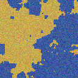
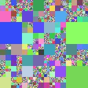
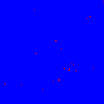
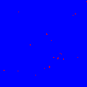
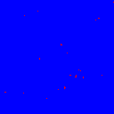
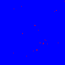
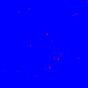
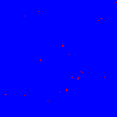
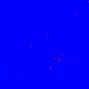

# 実験報告書（generated_data）

## 1. 人工データの生成

### 1.0 生成したデータの数

| データ | 四分木の数 | 四分木1つに対する統合領域の数 | 統合領域1つに対するラベル画像の数 | ラベル画像1つに対する画像の数 | 総数 |
|---|---:|---:|---:|---:|---:|
| 学習データ | 100 | 1 | 1 | 1 | 100 |
| テストデータ | 3 | 3 | 2 | 2 | 12 |

### 1.1 生成モデルおよび設定したパラメータの値

- 四分木の事前分布

    $$
    p(T;\mathbf{g})=\prod_{s\in \mathcal{L}(T)}(1-g_s)\prod_{s'\in \mathcal{I}(T)}g_{s'}
    $$

    パラメータ$g_s$は四分木の深さごとに共通の値を取るものとして設定している．画像生成では以下のように値を設定した．

    | 深さ | 0 | 1 | 2 | 3 | 4 | 5 | 6 | 7 |
    |---|---:|---:|---:|---:|---:|---:|---:|---:|
    | パラメータ $g_s$ | 0.99 | 0.90 | 0.80 | 0.70 | 0.60 | 0.70 | 0.80 | 0.00 |

- 統合領域の事前分布: ddCRPモデル

    $$
    p(c_s=s'\mid T;\alpha,\beta,\eta)\propto
    \begin{cases}
    \dfrac{f(s,s')}{\alpha+\sum_{s''\in \mathcal{L}(T)\setminus\{s\}}f(s,s'')} & (s\neq s')\\
    \dfrac{\alpha}{\alpha+\sum_{s''\in \mathcal{L}(T)\setminus\{s\}}f(s,s'')} & (s=s')
    \end{cases}
    $$

    ここで，親和度関数$f(s, s')$は以下のように設定している:

    $$
    f(s,s')=
    \begin{cases}
    \exp\left(\beta B(s,s')+\eta(\mathrm{depth}(s)-\mathrm{depth}(s'))\right) & (\text{$s$と$s'$が隣接している})\\
    0 & (\text{$s$と$s'$が隣接していない})
    \end{cases}
    $$

    パラメータは以下のように設定した．

    - $\alpha=1\times10^{-8}$
    - $\beta=8.0$
    - $\eta=6.0$

    ($B(s, s')$は隣接するノード同士の共有辺の長さを表す)

- ラベルの事前分布: 領域ごとに独立なロジスティック回帰モデル
    $$
    p(x_r;\omega)=
    \frac{\exp\left(\omega_{x_r}^\top\phi(r)\right)}{\sum_{x\in\mathcal{X}}\exp\left(\omega_x^\top\phi(r)\right)}
    $$
	- $\mathcal{X} = \{0, 1\}$
	- ロジスティック回帰係数$\bm{\omega}$:
		- $x=0$: $\bm{\omega}_0 = [-0.2, 0.3,-0.4,0.9]$
		- $x=1$: $\bm{\omega}_1 = [0.2, -0.3,0.4,-0.9]$

- ピクセル値の尤度関数: ラベルごとに独立な正規分布

    $$
    p(Y_r\mid x_r;\theta)=\prod_{(i,j)\in r}p(y_{(i,j)};\theta_{x_r}),\quad
    y_{(i,j)}=\mu_{x_r}+\epsilon_{(i,j)},\ \epsilon_{(i,j)}\sim\mathcal{N}(0,\Sigma_{x_r})
    $$
	- $x=0$:  $\mu_{0} = [60,90,160]$,   $\Sigma_{0}=\text{diag}[20,20,20]$
	- $x=1$:  $\mu_{0} = [200,170,80]$,  $\Sigma_{1}=\text{diag}[18,18,18]$

## 2. パラメータ推定の結果（estimated_param と true_param の比較）

生成した学習データを用いて事前分布や尤度関数のパラメータを推定した．

### 2.1 四分木のパラメータ推定の結果

ラベル推定結果は以下の通り．

| 深さ | 真値 | 推定値 | 誤差（推定値-真値） |
|---|---:|---:|---:|
| 0 | 0.99 | 1.0000 | +0.0100 |
| 1 | 0.90 | 0.9050 | +0.0050 |
| 2 | 0.80 | 0.7737 | -0.0263 |
| 3 | 0.70 | 0.6237 | -0.0763 |
| 4 | 0.60 | 0.5185 | -0.0815 |
| 5 | 0.70 | 0.5399 | -0.1601 |
| 6 | 0.80 | 0.4646 | -0.3354 |
| 7 | 0.00 | 0.0000 | +0.0000 |

平均絶対誤差（MAE）は約 $0.0868$.

### 2.2 ラベルのパラメータ推定の結果

ラベルモデル（logistic）の推定結果は以下の通り．

| ラベル | 係数 | 真値 | 推定値 | 誤差（推定値-真値） |
|---|---|---:|---:|---:|
| 0 | $w_{0,0}$ | -0.2000 | -2.0396 | -1.8396 |
| 0 | $w_{0,1}$ | 0.3000 | -0.2063 | -0.5063 |
| 0 | $w_{0,2}$ | -0.4000 | 0.5386 | +0.9386 |
| 0 | $w_{0,3}$ | 0.9000 | 1.6815 | +0.7815 |
| 1 | $w_{1,0}$ | 0.2000 | 2.0396 | +1.8396 |
| 1 | $w_{1,1}$  | -0.3000 | 0.2063 | +0.5063 |
| 1 | $w_{1,2}$  | 0.4000 | -0.5386 | -0.9386 |
| 1 | $w_{1,3}$   | -0.9000 | -1.6815 | -0.7815 |

### 2.3 ピクセル値のパラメータ推定

ピクセルモデル（正規分布）の推定結果は以下の通り．

| ラベル | チャンネル | 真値 mean | 推定値 mean | 誤差（推定値-真値） |
|---|---|---:|---:|---:|
| 0 | R | 60.0000 | 59.4879 | -0.5121 |
| 0 | G | 90.0000 | 89.4926 | -0.5074 |
| 0 | B | 160.0000 | 159.5206 | -0.4794 |
| 1 | R | 200.0000 | 199.5111 | -0.4889 |
| 1 | G | 170.0000 | 169.5191 | -0.4809 |
| 1 | B | 80.0000 | 79.4721 | -0.5279 |

| ラベル | チャンネル | 真値 std | 推定値 std | 誤差（推定値-真値） |
|---|---|---:|---:|---:|
| 0 | R | 20.0000 | 19.9620 | -0.0380 |
| 0 | G | 20.0000 | 20.0122 | +0.0122 |
| 0 | B | 20.0000 | 20.0281 | +0.0281 |
| 1 | R | 18.0000 | 17.9749 | -0.0251 |
| 1 | G | 18.0000 | 17.9892 | -0.0108 |
| 1 | B | 18.0000 | 17.9868 | -0.0132 |

- mean の MAE: 約 $0.4994$
- std の MAE: 約 $0.0212$

## 3. ラベル推定の結果

統合領域の事前分布のパラメータを以下の4パターンで設定し，結果を比較した．

1. $\beta=8.0$, $\eta=6.0$, $\alpha = 1.0\times10^{-8}$ (真の値と同じ)
2. $\beta=8.0$, $\eta=30.0$, $\alpha = 1.0\times10^{-8}$
3. $\beta=30.0$, $\eta=6.0$, $\alpha = 1.0\times10^{-8}$
4. $\beta=30.0$, $\eta=30.0$, $\alpha = 1.0\times10^{-8}$

#### 3.1  入力画像と正解ラベル

| 入力画像 | 真のラベル | 真の領域 | 真の四分木 |
|---|---|---|---|
|  |  |  |  |

#### 3.2  ラベル推定結果と diff 画像の比較

diff 画像が存在するのは iter1 から iter5 までなので，以下では各セルの上段にラベル推定結果，下段に diff 画像を配置して比較する．

| 条件 | iter1 | iter2 | iter3 | iter4 | iter5 |
|---|---|---|---|---|---|
| beta=8.0, eta=6.0 |   |   |   |   |   |
| beta=8.0, eta=30.0 |   |   |   |   |   |
| beta=30.0, eta=6.0 |   |   |   |   |   |
| beta=30.0, eta=30.0 |   |   |   |   |   |

